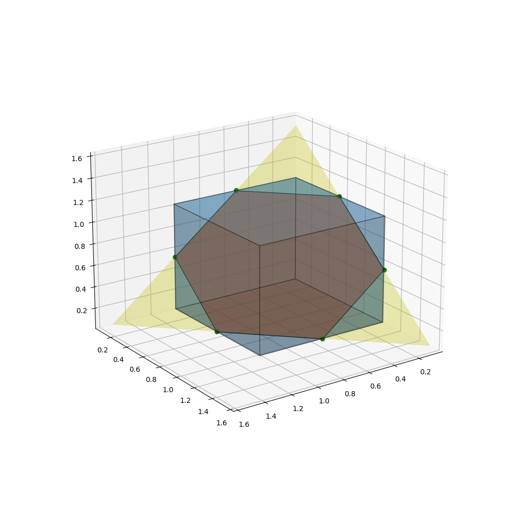
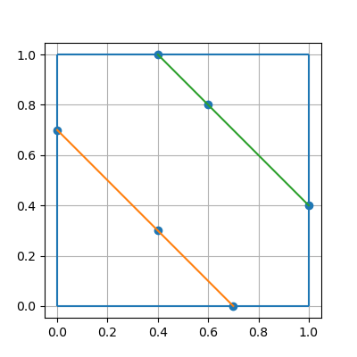

# HW1

[HW1pdf](../../HWpdf/Homework1-2024.pdf)

<!-- toc -->

## 1. Exercise 2.10 of Convex Optimization

$$ C=\\{ x\in R^n | x^T A x + b^T x + c \le 0\\} $$
with \\( A\in S^n, \quad b\in R^n, \quad c\in R \\).

(a) Show that \\( C\\) is \\( A\succeq  0\\) (which means \\( A\\) is positive semidefinite).    
> 
>   It is sufficient to show that \\( f(x) = x^T A x + b^T x + c \\) is a convex function (for the **epi** of a convex function is convex.)
>   i.e. $$ \frac{f(x_1) + f(x_2)}{2} \ge f(\frac{x_1+x_2}{2}) $$
>   that is 
>   $$ x_1^TAx_1 + x_2^TAx_2 \ge \frac{1}{2}(x_1^T+x_2^T)A(x_1 + x_2) $$
>   $$ \Leftrightarrow x_1^TAx_1 + x_2^TAx_2 \ge x_1^TAx_2 + x_2^TAx_1 $$
>   $$ \Leftrightarrow (x_1-x_2)^TA(x_1 - x_2) \ge 0 $$
>   it is true since \\( A\\) is positive semidefinite. \\(\blacksquare\\)  

(b) Show that intersection of \\(C\\) and the hyperplane defined by \\(g^T x + h = 0 \\) ( where \\(g \ne 0\\) ) is convex if \\(A + λgg^T \succeq 0 \\) for some \\(λ ∈ R \\). Are the converses of these statements true?
>
> Let $$ H = \\{x | g^T x + h = 0\\} $$
> for \\(x\in H\\), \\(x\in C\\) equavalent to
> $$ x^T (A+ λgg^T) x + b^T x + c - λh^2 \le 0 $$
> whose solution set defined \\(\tilde{C}\\),   
> if \\( A + λgg^T \succeq 0 \\) for some \\(λ ∈ R \\), then
> \\(\tilde{C}\\) is convex.
> $$ x \in H \cap C = H \cap \tilde{C} $$
> is intersection of two convex sets, so it is convex.  \\(\blacksquare\\)  
>
> the converses is **false**.
> let's consider the case
> $$ A = \begin{bmatrix} -1 & 0 \\\\ 0 & -1 \end{bmatrix}, g = \begin{bmatrix} 0 \\\\ 1 \end{bmatrix}, b=0, h = 0, c = 0 $$
> where \\( C=R^2\\), \\( H = \\{ (x_1, x_2) | x_2 = 0\\} \\),
> \\( C \cap H \\) is obvious convex,
> but \\( A + λgg^T = \begin{bmatrix} -1 & 0 \\\\ 0 & -1 + λ \end{bmatrix}\\) can never be positive semidefinite.

## 2. Exercise 2.18 of Convex Optimization

Invertible linear-fractional functions.     
$$ f(x) = \frac{Ax+b}{c^Tx+d}, \qquad dom f = \\{x | c^Tx+d > 0\\} $$
Suppose the matrix
$$ Q=\\begin{bmatrix} A & b \\\\ c^T & d \end{bmatrix} $$
is nonsingular. Show that \\(f\\) is an invertible linear fractional function.

> let \\( y = \(Ax+b)/(c^Tx+d) \\), then
> $$ Q\begin{bmatrix} x \\\\ 1 \end{bmatrix} = (c^Tx+d)\begin{bmatrix} y \\\\ 1 \end{bmatrix} $$
> since \\(Q\\) is inversible, and \\( c^Tx+d > 0 \\), we get
> $$ Q^{-1}\begin{bmatrix} y \\\\ 1 \end{bmatrix} = \frac{1}{c^Tx+d} \begin{bmatrix} x \\\\ 1 \end{bmatrix} $$ 
> Then
> $$ x = P(\begin{bmatrix} x \\\\ 1 \end{bmatrix}) 
> = P(Q^{-1}\begin{bmatrix} y \\\\ 1 \end{bmatrix}) $$
> so \\(f\\) is bijective.  
>
> [Schur complement Matrix Analysis 0.8.5](../../../Library/Matrix%20analysis%20Cambridge%20University%20Press%20.pdf)
> 1. For \\(A\\) invertible,
> $$ Q = \begin{bmatrix} A & b \\\\ c^T & d \end{bmatrix}
> = \begin{bmatrix} I &  \\\\ c^TA^{-1} & 1 \end{bmatrix}
> \begin{bmatrix} A &  \\\\  & d-c^TA^{-1}b \end{bmatrix}
> \begin{bmatrix} I & A^{-1}b \\\\  & 1 \end{bmatrix}
> $$ 
> $$ Q^{-1}
> = \begin{bmatrix} I & -A^{-1}b \\\\  & 1 \end{bmatrix}
> \begin{bmatrix} A^{-1} &  \\\\  & (d-c^TA^{-1}b)^{-1} \end{bmatrix}
> \begin{bmatrix} I &  \\\\ -c^TA^{-1} & 1 \end{bmatrix} \\\\
> = \begin{bmatrix} 
> A^{-1} + A^{-1}b (d-c^TA^{-1}b)^{-1} c^TA^{-1} & -A^{-1}b (d-c^TA^{-1}b)^{-1} \\\\
> -(d-c^TA^{-1}b)^{-1} c^TA^{-1} & (d-c^TA^{-1}b)^{-1}
> \end{bmatrix}
> $$ 
> so,
> $$ x = \frac{(A^{-1} (d-c^TA^{-1}b) + A^{-1}b c^TA^{-1})y - A^{-1}b }{-c^TA^{-1}y + 1} $$
> $$ dom f^{-1} = \\{ y | (d-c^TA^{-1}b)(-c^TA^{-1}y + 1) > 0 \\} $$
>
> 2. If \\(d \ne 0\\), similarly, we get
> $$ Q = \begin{bmatrix} A & b \\\\ c^T & d \end{bmatrix}
> = \begin{bmatrix} I & bd^{-1} \\\\  & 1 \end{bmatrix}
> \begin{bmatrix} A-bd^{-1}c^T &  \\\\  & d \end{bmatrix}
> \begin{bmatrix} I &  \\\\ d^{-1}c^T & 1 \end{bmatrix}
> $$
> $$ Q^{-1}
> = \begin{bmatrix} I &  \\\\ -d^{-1}c^T & 1 \end{bmatrix}
> \begin{bmatrix} (A-bd^{-1}c^T)^{-1} &  \\\\  & d^{-1} \end{bmatrix}
> \begin{bmatrix} I & -bd^{-1} \\\\  & 1 \end{bmatrix} \\\\
> = \begin{bmatrix}
> (A-bd^{-1}c^T)^{-1}   &   -(A-bd^{-1}c^T)^{-1}bd^{-1} \\\\
> -d^{-1}c^T(A-bd^{-1}c^T)^{-1}     &   d^{-1}+d^{-1}c^T(A-bd^{-1}c^T)^{-1}bd^{-1}
> \end{bmatrix}
> $$ 
> So,
> $$ x = \frac{d(dA-bc^T)^{-1}y - (dA-bc^T)^{-1}b}{-c^T(dA-bc^T)^{-1}y + d^{-1}+d^{-1}c^T(dA-bc^T)^{-1}b} $$
> $$ dom f^{-1} = \\{ y | -c^T(dA-bc^T)^{-1}y + d^{-1}+d^{-1}c^T(dA-bc^T)^{-1}b > 0 \\} $$
> 
> 3. If \\(A\\) is **not** invertable and \\(d = 0\\), （啊！我要疯了，哪里有这个定理啊，我快算死了！）   
> Since $$ Q = \begin{bmatrix} A & b \\\\ c^T & 0 \end{bmatrix} $$ is nonsingular,
> we have
> -  \\(rank(A) = n-1\\), the kernel space  denoted \\(\lambda v\\),  
> - \\(rank([A \quad b] = n) \\) 
> - \\( c^Tv\ne 0 \\),  
> - \\(b \ne 0\\).    
> Then we conclude \\( A + bc^T \\) is invertible!    
> Otherwise, there is some vector \\(u\\) s.t. \\( Au + bc^Tu = 0\\), 
> but we have \\( rank([A \quad b]) > rank(A) = n-1\\), 
> we deduce \\( Au = 0 \\) and \\(bc^Tu = 0\\).
> so we get \\( u = \lambda v\\), and then \\( 0 = \lambda bc^Tv \Rightarrow \lambda = 0\\)    
> Now, we can get
> $$ 
> Q = \begin{bmatrix}
>    A & b \\\\ c^T & 0
> \end{bmatrix}
> = \begin{bmatrix}
>    A+bc^T & b \\\\ c^T & 0
> \end{bmatrix}
> \begin{bmatrix}
>    I & 0 \\\\ -c^T & 1
> \end{bmatrix}
> $$
> denote \\( \tilde{A} = A + bc^T \\)
> $$
> Q^{-1} = \\\\ \begin{bmatrix}
>    I & 0 \\\\ c^T & 1
> \end{bmatrix}
> \begin{bmatrix} 
> \tilde{A}^{-1} - \tilde{A}^{-1}b (c^T\tilde{A}^{-1}b)^{-1} c^T\tilde{A}^{-1} & -\tilde{A}^{-1}b (c^T\tilde{A}^{-1}b)^{-1} \\\\
> (c^T\tilde{A}^{-1}b)^{-1} c^T\tilde{A}^{-1} & -(c^T\tilde{A}^{-1}b)^{-1}
> \end{bmatrix}
> $$
> （啊，我实在是不想写了，领会意思吧！我都不知道这有什么用。）

## 3. convex hull/Sparse Representation of a Polytope

reference:
[Sparse representation of a polytope and recovery of sparse signals and low-rank matrices](./Cai%20and%20Zhang%20-%202014%20-%20Sparse%20Representation%20of%20a%20Polytope%20and%20Recovery%20o.pdf)

Please give the Sparse Representation of a Polytope \\(A = \\{x ∈ R^n : ‖x‖_∞ ≤ θ, ‖x‖_1 ≤ sθ\\} \\).

For any \\(v ∈ R^n\\), define the set of sparse vectors \\( U (\theta, s, v) ⊂ R^n \\) by    
$$
U (\theta, s, v) = \\{ u \in R^n : supp(u) \subset supp(v) \quad \\|u\\|\_0 \le s, \\|u\\|\_1 = \\|v\\|\_1, \\|u\\|_{\infty} ≤ \theta \\} 
$$

Any \\( v\in A\\) can be represented as
$$ 
v = \sum_{i=1}^N \lambda_i u_i, \quad with \quad 0\le\lambda_i\le 1, \quad \sum_{i=1}^N \lambda_i = 1, \quad u_i \in U(\theta, s, v)\\ 
$$

> In the paper, the main idea of the proof is to fix some components of \\(v\\) and then view the left components as a vector \\(\tilde{v}\\) that analogous to the origin problem in lower dimension. 
> And use the technique of decomposition of vector to the edge of the intersection of cube and hyperplane to decrease at least one dimension.
> The requests of \\(j\\) is found just to make sure that the decomposition of \\(\tilde{v}\\) satisfies the condition of \\(U(\theta, s, \tilde{v})\\).
>
> **But** here, we give a another expression, and deduce a little stronger conclusion.    
> Without loss of generality, we can assume that \\(\theta=1\\), and just consider the case \\(v \succeq 0\\).      
> For some \\(v\in A, \\|v\\|\_1 = t\\), we define 
> $$ P(t) = \\{ (a_i)_{i=1}^n \in U(1, s, v) : at\\, most\\, one\\, element \notin \\{ 0, 1 \\}\\} $$
> Indeed, \\(P(t)\\) is the extrime points of \\(conv\\,U(1, s, v)\\).         
> And points in \\(P(k,t)\\) is obviously \\(\lceil t\rceil\\)-sparse vectors.
> 
> e.g. For some \\(v, \\|v\\|= 1.5 \\)
> 
> \\(P(1, 0.5) = \\{ [1, 1/2, 0], [1, 0, 1/2], [0, 1, 1/2], [1/2, 1, 0], [1/2, 0, 1], [0, 1/2, 1] \\} \\), just like the graph in the paper.
> 
> We claim that \\(v\\) can be expressed by \\(P(k,t)\\).
>
> Consider \\(v=[a_1, ... , a_n], v\in A\\), if \\(v\notin P(t)\\), then it has two components, WLOG, noted \\(a_1, a_2 \notin \\{0, 1\\} \\). 
> - If \\(a_1+a_2 \le 1\\), then $$ v = \lambda_1u_1 + \lambda_2u_2, $$ where \\(\lambda_1 = \frac{a_1}{a_1+a_2}, \lambda_2=\frac{a_2}{a_1+a_2} \\) and \\( u_1 = [a_1+a_2, 0, a_3, ..., a_n], u_2 = [0, a_1+a_2, a_3, ..., a_n] \\).
> - If \\(1< a_1+a_2 < 2\\), then $$ v = \lambda_1u_1 + \lambda_2u_2, $$ where \\(\lambda_1 = \frac{1-a_1}{2-a_1+a_2}, \lambda_2=\frac{1-a_2}{2-a_1+a_2} \\) and \\( u_1 = [a_1+a_2-1, 1, a_3, ..., a_n], u_2 = [1, a_1+a_2-1, a_3, ..., a_n] \\).
>      
> It's obvious that \\(\lambda_1+\lambda_2 = 1\\) and \\(\\|u\\|\_i=t, i=1, 2\\).
> And the number of components of \\(u_1, u_2\\) that not in \\(\\{0, 1\\}\\) is less than \\(v\\).     
> So, by induction, we can conclude that \\(v\\) can be expressed by \\(P(t)\\).
> 