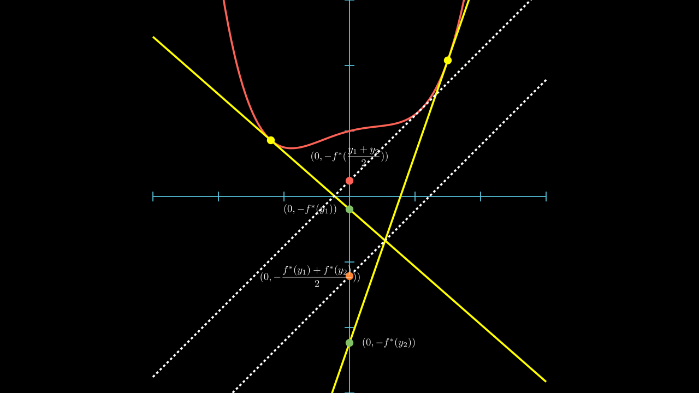

# 共轭函数 (The conjugate function)

设函数 \(f: R^n \to R\)，函数 \(f^*: R^n \to R\)，

$$ f^*(y) = \sup_{x\in \text{dom}f} \{y^T x - f(x)\} $$

称为 \(f\) 的 **共轭函数**(conjugate function)。

!!! theorem
    共轭函数是无条件凸的！

    

