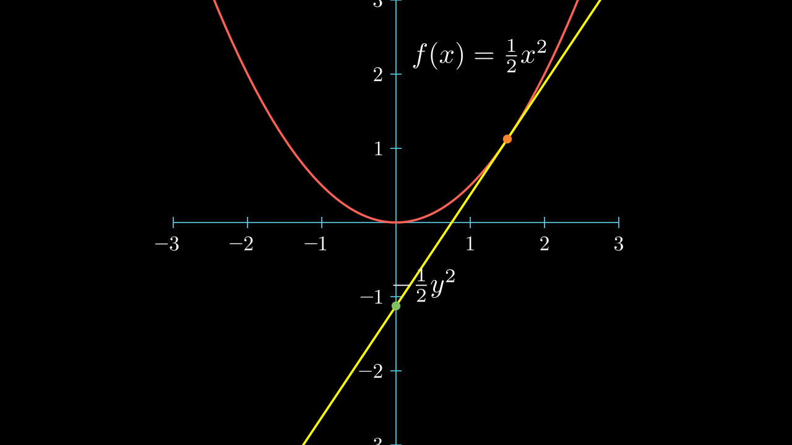

# 共轭函数 ( The conjugate function )

设函数 \(f: R^n \to R\)，函数 \(f^*: R^n \to R\)，

$$ f^*(y) = \sup_{x\in \text{dom}f} \{y^T x - f(x)\} $$

称为 \(f\) 的 **共轭函数**(conjugate function)。

!!! view
    我们如何直观的理解什么是共轭函数呢？

    $$ f^*(y) = \sup_{x\in \text{dom}f} \{y^T x - f(x)\} = -\inf_{x\in \text{dom}f} \{f(x) - y^T x\} $$

    <video src="../media/videos/convexfunc/720p30/ConjugateFunc.mp4" width="100%"  type="video/mp4" controls="controls" frameborder="0" allowfullscreen="true" webkitallowfullscreen="true" mozallowfullscreen="true" oallowfullscreen="true" msallowfullscreen="true"></video>

!!! theorem
    共轭函数是无条件凸的！

    

## 范数的共轭函数 Conjugate of Norm

令 \(f(x) = \|x\|, x\in R^n\)，那么 \(f^*(y)\) 是什么呢？     
根据定义

$$ f^*(y) = \sup_{x\in R^n} \{ y^T x - \|x\| \} $$

!!! view
    对于 \(n=1\)，\(f(x)= |x|\) 我们有直观的看法：

    

    我们立即得到

    $$ f^*(y) = \mathbb{I}_{ |y| \le 1} = \begin{cases}
        0, & |y| \le 1 \\ +\infty, & |y| > 1
    \end{cases} $$

但是对于一般的 **向量范数** ( Norm ) 

$$ f(x)=\|x\|_p = \left(\sum_{j=1}^m |x_j|^p\right)^{1/p}, \qquad 1\le p\le \infty $$

他的共轭函数是什么呢？   

!!! tip

    我们这里利用一点泛函的知识 （或者仅使用 Hölder 不等式） ，
    
    $$ \sum_{i=1}^n x_i y_i \le \left(\sum_{i=1}^n |x_i|^p\right)^{1/p} \left(\sum_{i=1}^n |y_i|^q\right)^{1/q} $$

    即

    $$ y^T x \le \|y\|_q\|x\|_p $$

    其中 \(\frac{1}{p} + \frac{1}{q} = 1, p, q \ge 1\)，等式成立条件是 \(x,y\) 方向相同。
    
    把 \(y\) 看成 \( (R^n， \|\cdot\|_p) \) 上的线性泛函 \(T_y\)，\(\langle T_y, x\rangle = y^T x\) . 那么

    $$ \|T_y\| = \sup_{x\in R^n} \frac{y^T x}{\|x\|_p} = \|y\|_q $$

    称 \(\|\cdot\|_q\) 是 \(\|\cdot\|_p\) 的 **对偶范数**。

$$ f^*(y) = \sup_{x\in R^n} \{ y^T x - \|x\| \} \le \sup_{x\in R^n} \{ \|y\|_q \|x\|_p - \|x\|_p \} = \sup_{x\in R^n} (\|y\|_q-1) \|x\|_p $$

因此，我们可以直接得到

$$ f^*(y) = \mathbb{I}_{ \|y\|_q \le 1} = \begin{cases}
    0, & \|y\|_q \le 1 \\ +\infty, & \|y\|_q > 1
\end{cases} $$

这符合我们在直观上所看到的。

## 范数平方的共轭函数 Conjugate of Norm Squared

我们研究下面这样函数的共轭函数

$$ f(x) = \frac{1}{2} \|x\|_p^2 $$

!!! view

    同样的，对于 \(n=1\), \(f(x)= \frac{1}{2}x^2\) 我们有：

    

    我们得到

    $$ f^*(y) = \frac{1}{2}y^2 $$

同样的，对于一般的 \(f(x) = \frac{1}{2} \|x\|_p^2, x\in R^n\)，他的共轭函数又是什么呢？         
根据上面的推导， 我们有所猜测

$$ f^*(y) = \frac{1}{2} \|y\|_q^2 $$

事实上，

$$ \begin{align}
    f^*(y) &= \sup_{x\in R^n} \{ y^T x - \frac{1}{2} \|x\|_p^2 \} \le \sup_{x\in R^n} \{ \|y\|_q\|x\|_p - \frac{1}{2}\|x\|_p^2 \}    \\
    &= \sup_{x\in R^n} \{ \frac{1}{2}\|y\|_q^2 - \frac{1}{2}(\|y\|_q - \|x\|_p)^2 \} \\
    &= \frac{1}{2}\|y\|_q^2
\end{align}$$