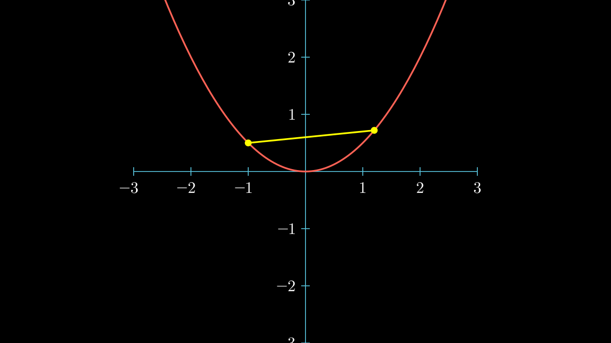

# 凸函数

函数 \(f：R^n→R\) 是 **凸**(convex) 的，如果 \(\text{dom} f\) 是凸集，且对所有的 \(x，y∈\text{dom} f\)，和 \(0≤θ≤1\) ，都有

$$ f(\theta x+(1-\theta y)) ≤ \theta f(x)+(1-\theta)f(y) $$
<!-- 
<video src="./media/videos/convexfunc/720p30/ConvexFunc.mp4" width="100%"  type="video/mp4" controls="controls" frameborder="0" allowfullscreen="true" webkitallowfullscreen="true" mozallowfullscreen="true" oallowfullscreen="true" msallowfullscreen="true"></video> -->

## 上方图

$$ epi(f) = \{ (x, t) \in R^{n+1} | f(x) ≤ t \} $$

!!! theorem
    \(f\) 是凸函数，当且仅当 \(epi(f)\) 是凸集。

## 下半连续函数

定义1：\(epi(f)\) 是闭集，则称 \(f\) 是下半连续函数。

定义2：对任意的 \(x\in \text{dom} f\)，和序列 \(\{y_n\}, \lim_{n→∞} y_n = x\)，有

$$ f(x) ≤ \liminf_{n→∞} f(y_n) $$

则称 \(f\) 是下半连续函数。

!!! note
    这两种定义是等价的。

