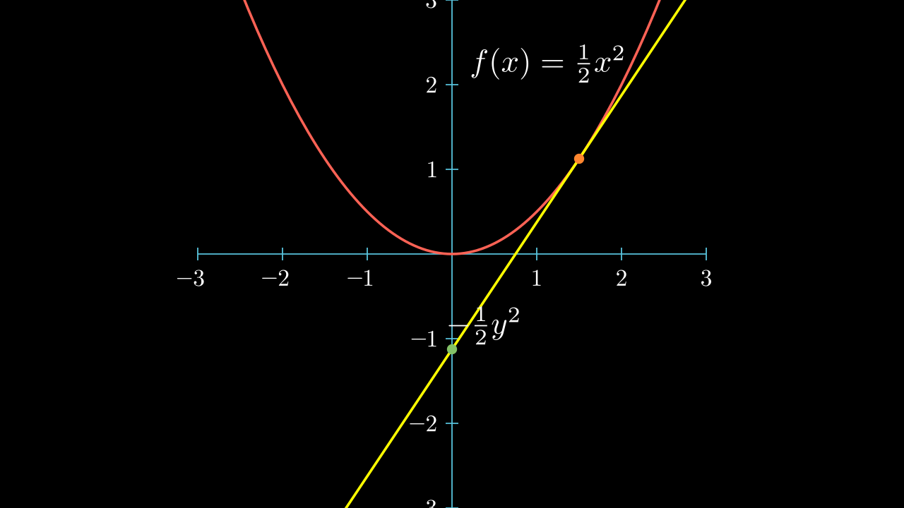

# SubGradient 次梯度

上一节我们介绍了 [共轭函数](./ConjugateFunction.md)

我们发现，对于凸函数 \(f\)，直线    

$$ \langle y, x \rangle - f^*(y)  $$

始终位于 \(f\) 的下方，且恰好是 \(f\) 在 **切点** 处的切线。

## 定义

对于适当的 **凸函数** \(f : X \rightarrow \mathbb{R}\)，
若 \(g\in X^*\) 满足

$$ f(y) \ge f(x) + \langle g, y-x \rangle, \quad \forall y \in \text{dom}(f) $$

则称 \(g\) 是 \(f\) 在 \(x\) 处的一个 **次梯度**。      
进一步，称集合

$$ \partial f(x) = \{ g \in X^* : f(y) \ge f(x) + \langle g, y-x \rangle, \quad \forall y \in \text{dom}(f)\subset X \} $$

是 \(f\) 在 \(x\) 处的 **次微分**。

## Examples

**1**.

\(f (x) = ‖x‖_1 = \sum_{j=1}^n |x_j |\)

$$ \partial f(x) = \{g : g_i = \begin{cases}
    \text{sign}(x_i), & \text{if } x_i \neq 0 \\
    [-1, 1], & \text{if } x_i = 0
\end{cases} \} $$

**2**.

\(f(x) = \|x\|_\infty\)

设 \([i], i=1, \cdots , r\) 是满足 

$$ |x_{[i]}| = \|x\|_\infty , 1 \le i \le r$$

的指标，那么 \(f(x)\) 的次微分是

$$ \partial f(x) = \begin{cases} 
    \{g \in \text{span}\{ e_{[1]} , ..., e_{[r]} \}:    \\
    \qquad \qquad x_{[i]}g_{[i]} \ge 0,  \quad 1 \le i \le r              \\
    \qquad \qquad \sum_{i=1}^r \text{sign}(x_{[i]}) g_{[i]} = 1 \}, & x \neq 0 \\
    \{g: \sum_{i=1}^n |g_i| \le 1\} & x = 0
    \end{cases} $$

<iframe height=600 width=200% src="../maxx_1.html" frameborder="0" allowfullscreen></iframe>

## Subgradient and Conjugate 次梯度与共轭函数

看过上面的例子，我们可以意识到次梯度和共轭函数是相互关联的。

设 \(f : X \rightarrow \mathbb{R}\) 是一个适当的 **凸函数** ，        
对于某个 \(x\in \text{dom}(f)\)，若 \(g \in \partial f(x)\)，那么

$$ f(y) \ge f(x) + \langle g, y-x \rangle, \quad \forall y \in \text{dom}(f) $$

即

$$ \langle g, y \rangle - f(y) \le \langle g, x \rangle - f(x) $$

则

$$ f^*(g) = \sup_{y\in \text{dom}(f)} \langle g, y \rangle - f(y) = \langle g, x \rangle - f(x)$$

或者说

$$ -f^*(g) = f(x) - \langle g, x \rangle $$

其中 \(x\) 是使得 \(g\in \partial f(x)\) 的点。

!!! Corollary

    回忆，[范数的共轭函数](./ConjugateFunction.md#conjugate-of-norm) \(f(x) = \|x\|\)，则

    $$ f^*(g) = \mathbb{I}_{\|g\|_\infty\le 1} $$

    示性函数的范围恰恰是 次梯度 **所有可能** 的集合。

## Subgradient of Conjugate 共轭函数的次梯度

<video src="../media/videos/subgrad/720p30/Subgrad.mp4" width="100%"  type="video/mp4" controls="controls" frameborder="0" allowfullscreen="true" webkitallowfullscreen="true" mozallowfullscreen="true" oallowfullscreen="true" msallowfullscreen="true"></video>

通过动画我们发现，对于适当的凸函数 \(f\)，\(-f^*(g)\) 随 \(g\) 的增大而减小。       
那么差了多少呢？    
事实上设 \(x_1, x_2\) 是使得 \(\langle g_i, x_i \rangle - f(x_i) = f^*(g_i)\) 的点，也就是切点，        
若 \(x_1 = x_2 = x\)，那么

$$ f^*(g_2) - f^*(g_1) = \langle g_2, x_2 \rangle - f(x_2) - \langle g_1, x_1 \rangle + f(x_1)  = \langle g_2-g_1, x \rangle $$

因此我们发现，对于凸函数 \(f\)

$$ \partial f^*(g) = \{x : g\in \partial f(x)\} $$

显然 \(\partial f^*(g)\) 是凸集。

