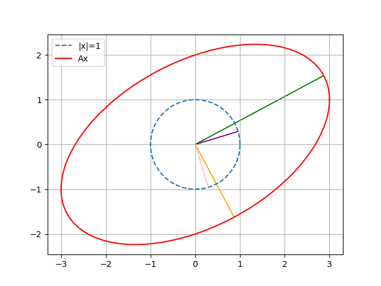

# 奇异值分解 SVD

对于一个线性变换 \(A\)，我们思考它对于单位圆的作用。
这里我们用 \(2\times 2\) 矩阵演示。

$$ A=\begin{bmatrix}
    3 & 0 \\ 1 & 2
\end{bmatrix} $$

\(A\) 把单位圆（球）映成一个椭圆（球）。而椭圆长短轴的原像好像也是正交的？

我们知道椭圆的长短轴是 $\|Ax\|, x^Tx=1$ 的极值点,
也就是 $\|Ax\|^2=x^TA^TAx$ 的极值点。

那么，由 [Lagrange 乘数法定理](../ConvexOptimization/Duality/LagrangeDual.md)，极值点满足，存在一个 $\lambda$ 使得

$$ \dfrac{\partial}{\partial{x}}(x^TA^TAx-\lambda x^Tx)=0 $$

根据矩阵微分法则

$$ LHS=2(A^TAx-\lambda x) $$

因此，$\lambda$ 是对称矩阵 $A^TA$ 的特征值，\(x\)是对应的特征向量。我们选择$n$个单位正交的特征向量组成 $V=(v_i)_{i\le n}$。
我们有

$$ \langle Av_i,Av_j\rangle=v_i^TA^TAv_j = \lambda_jv_i^Tv_j = 0 $$

故 $AV$ 的列正交，将其单位化我们有

$$ AV=U\Sigma $$

其中 $\Sigma=\text{diag}(\sigma_i)$ 是正的对角矩阵， $U$是单位正交方阵，即

$$A=U\Sigma V^T$$

由于 $\|Av_j\|^2=v_j^TA^TAv_j = v_j^T V\Sigma^2V^T v_j = \sigma_j^2$,
故 $\sigma_j=\sqrt{\lambda_j}$

以上，我们重新发现一遍矩阵的 **奇异值分解** (SVD).
