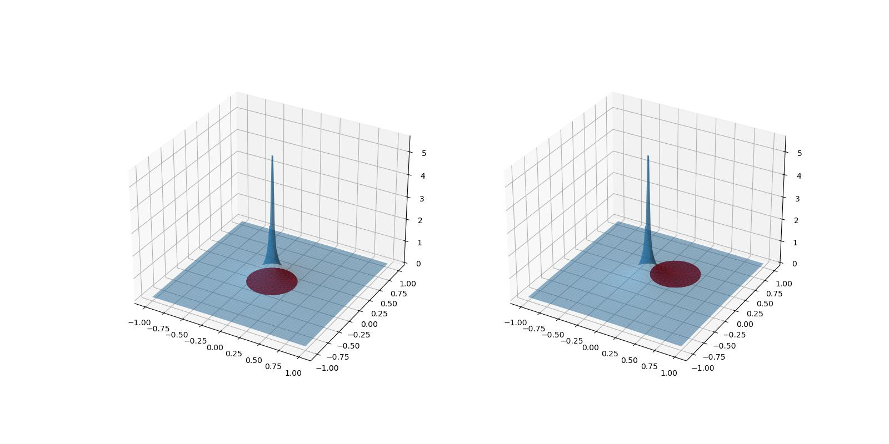

# Laplace方程

[Lawrence C.Evans Partial differential equations 2.2](../index.md#教材)

1. Laplace's equation  $$ \Delta u = 0 $$  
2. Poisson's equation  $$ -\Delta u = f $$  

满足 Laplace 方程的函数称为 **调和函数**(harmonic function)。
调和函数是函数本身的几何性质，所以坐标轴平移、旋转都不影响函数的调和性质。

## 调和函数基本解

$$
\Phi(x) :=
\begin{cases}
    -\frac{1}{2\pi}\log|x|  & (n=2) \\
    \frac{1}{n(n-2)\alpha(n)}\frac{1}{|x|^{n-2}}    & (n \ge 3)
\end{cases}
$$

基本解的形式是通过解 **径向函数** 得到的，它满足 Laplace 方程，但它有一个 **奇点** 0。  
!!! think
    基本解的系数是怎么选取的呢？   
    在这之前让我们想想基本解有什么用
    （参考[叠加原理](../../RealAnalysis/Convolution/Superposition.md)）。  
    就是因为基本解在奇点处不满足Laplace方程，那么 \(-\Delta\circ\Phi(0)\) 总应该有个特殊的‘值'，
    那么我们只要选取一个合适的值，让 \(-\Delta\circ\Phi(0) = \delta\) ，
    那么根据叠加原理，\(u=\Phi\ast f\) 就是满足 Poisson 方程的函数。

## Poisson方程的解

$$
u(x) = \Phi\ast f(x) = \int_{R^n} \Phi(x-y)f(y) dx
$$

我们这里给出的是满足方程的全空间的解，所以还没有边界条件的限制。    
我们上一节已经从直观上得到了 Poisson 方程的解。只需要严格的证明就行。   
但是，我们这里只对

$$ f\in C_c^2(\mathbb{R^n}) $$ 

来证明
（这自然是因为对更低光滑性的 \(f\) 的证明稍微有点困难，而不是解本身错误）。
事实上，对于 \(f\) 所在空间的选取，也是随着这个证明的需要而定的。

1. 为了保证函数是存在的，我们意识到需要证明 \(\int_{B(0, r)}\Phi(x)\) 是有界的。

2. 利用卷积性质，得到 
   $$ u_{x_i}=\int_{R^n}\Phi(y)f_{x_i}(x-y)dy $$    
   $$ u_{x_ix_j}=\int_{R^n}\Phi(y)f_{x_ix_j}(x-y)dy $$  
   这里就是为什么对 \(f\) 的连续性有要求。

3. 由于我们不想动 \(f\)，那么就通过 [Gauss-Green定理](../../MathematicalAnalysis/SurfaceIntegral/GaussGreen.md) 来将微分算子转移到 \(\Phi\) 上。  

4. 由于 \(\Phi\) 在 0 处是奇点，将积分区间分为两部分 
   $$ -\Delta u=\int_{B(0,\epsilon)} + \int_{R^n - B(0,-\epsilon)} = I_\epsilon + J_\epsilon $$ 
   当 \(\epsilon\to 0\) 的时候，\(I_\epsilon\to 0\), \(J_\epsilon\to f(x)\)。
整理即可。

证明见[Lawrence C.Evans Partial differential equations 2.2.1.b Thm 1](../index.md#教材)

!!! question
    对于 \(n\ge 3\) 和 \(f\in C_c^2(R^2)\)， \(u(x)\) 是否是一致有界？
!!! solve
    如果你熟悉 **叠加原理** 那么直观上你会觉得这是显然的。  
    因为\(f\) 有界，支撑集也有界 \(supp(f)\subset B(0,r_0)\)，
    $$ u(x_0) = \Phi*f(x_0) = \int_{B(x_0, r)}\Phi(x)f(x_0-x)dx \le C|\int_{B(x_0, r)}\Phi(x)| $$
    而我们已经证明了 \(\int_{B(0, r)}\Phi(x)\) 是有界的（且随 \(r\to 0\)趋于0），而且\(\Phi\) 随着 \(r\) **单调减** !
    

    技术上证明有界性并不困难。由于 \(\Phi\) 在球内积分有界，且随 \(r\) 的增大趋于 0。

    {: align=right width=200}

    那么只要对积分区间如图分割即可。    
    \(B(x_0, r)\) 要么在橙色球内部，要么在紫色球外面，这使得积分都是有界的。

    但这样证明有点丑陋，事实上，在我们的直观中，由于单调性，以原点为中心的积分本身就应该是最大的，因为在中心处更大的函数值是‘更多’的。
    我们只是暂时缺乏一套说明他的语言。但我们很快就可以将几何直观翻译成数学语言。
    
    $$
    \begin{align}
        \int_{B(x_0, r)}\Phi(x)dx &= -\int yd\mu(\{x\in B(x_0, r)| \Phi(x)>y\})  \\
        &= \int_{y\in(0, \infty)} \mu(\{x\in B(x_0, r)| \Phi(x)>y\})dy   \\
        &= \int_{y\in(0, \infty)} \mu(\{x\in B(x_0, r)| \Phi(x)>y\})dy   \\
        &= \int_{y\in(0, \infty)} \mu(\{x| \Phi(x)>y\}\cap B(x_0, r))dy   \\
    \end{align}
    $$

    注意到 \(\{x| \Phi(x)>y\} = B(0, \Phi^{-1}(y))\)， 
    而我们直观上很容易得到

    $$ \mu(B(0, r_1) \cap B(0, r_2)) = \mu(B(0, \min\{r_1, r_2\})) \ge \mu(B(x_1, r_1) \cap B(x_2, r_2)) $$

    因此

    $$
    \begin{align}
        \int_{B(x_0, r)}\Phi(x)dx
        &= \int_{y\in(0, \infty)} \mu(\{x| \Phi(x)>y\}\cap B(x_0, r))dy   \\
        &\le \int_{y\in(0, \infty)} \mu(\{x| \Phi(x)>y\}\cap B(0, r))dy   \\
        &= \int_{B(0, r)}\Phi(x)dx
    \end{align}
    $$

    甚至我们可以得出 \( \int_{B(x_0, r)}\Phi(x)dx \) 是随 \(|x_0|\) 单调递减的。
    证明只需要小小改动一下，请你尝试一下吧。

## Problems

!!! question
    2 . 证明 Laplace方程是旋转不变的；即，若 \(O\) 是一个正交方阵， 定义
    $$ v(x):=u(Ox) $$ 
    那么 \(\Delta v = 0\).  
    （调和是一种曲面内蕴的几何性质。） 
!!! proof     
    $$ \nabla v = \nabla u(Ox) O $$ 

    $$ \begin{bmatrix}
    v_{11} & \cdots & v_{1n} \\ \vdots &  & \vdots \\ v_{n1} & \cdots & v_{nn} 
    \end{bmatrix} = \nabla (\nabla v) = \nabla(\nabla u(Ox) O) = O^T \begin{bmatrix}
    u_{11} & \cdots & u_{1n} \\ \vdots &  & \vdots \\ u_{n1} & \cdots & u_{nn} 
    \end{bmatrix} O $$

    而 \( \Delta v = v_{11}+...+v_{nn} = trace(V) = trace(O^T U O) = trace(U) = \Delta u = 0\)。

!!! question
    4 . 令 \(U\) 是有界开集，\(u\in C^2(U)\cap C(\bar{U})\) 是调和函数，证明

    $$ \max_{\bar{U}}u = \max_{\partial U}u $$  

!!! Proof
    对于 \(\epsilon>0\) 定义， \(u_\epsilon := u+\epsilon|x|^2 \)。则 \(\Delta u_\epsilon > 0\)
    由于 \(U\) 有界，且 \(u\) 在 \(\bar{U}\) 上连续，所以 \(u, |x|\) 有界。
    \(u_\epsilon\) 的最小值不能在内部取得。
    否则，若 \(u(x_0) = \max_{\bar{U}}u \)，且 \(B(x_0, \delta) \subseteq \bar{U} \)，
    那么 

    $$ u(x_0) < {-\mkern -19mu\int}_{B(x_0, \delta)} u(x) \le {-\mkern -19mu\int}_{B(x_0, \delta)} u(x_0) = u(x_0) $$

    矛盾。所以，

    $$ \max_{\bar{U}}u_\epsilon = \max_{\partial U}u_\epsilon $$

    我们有

    $$ \max_{\bar{U}}u = \lim_{\epsilon\to 0} \max_{\bar{U}}u_\epsilon = \lim_{\epsilon\to 0} \max_{\partial U}u = \max_{\partial U}u $$

!!! question
    5 . 如果 \(v\in C^2(\bar{U}) \)，且 $$ -\Delta \le 0 \quad in \\, U $$
    我们称 \(v\) 是一个 **次调和函数** (subharmonic)。 

    a. 证明 

    $$ v(x)\le {-\mkern -19mu\int}_{B(x, r)} v(y)dy \quad for \\, all \\, B(x,r) \subset U $$    

    b. 证明 \( \max_{\bar{U}}v = \max_{\partial U} v \)  
    c. 令 \(\phi : R \rightarrow R \) 是光滑凸函数。
    设 \(u\) 是调和函数，而 \(v := \phi(u) \) 。证明 \(v\) 是次调和的。     
    d. 证明当 \(u\)是调和函数时，\( v:=|Du|^2 \) 是次调和的 。  

!!! Proof    
    a. 与 [PDE 2.2.2 Thm 2](../index.md#教材) 几乎完全一样，令

    $$ \phi(r) := {-\mkern -19mu\int}_{\partial B(x, r)} v(y) dy $$

    $$ \phi'(r) = \frac{r}{n}{-\mkern -19mu\int}_{B(x,r)}\Delta v(y)dy \ge 0 $$

    $$ \phi(r) \ge \lim_{t\to 0}\phi(t) = v(x) $$

    So, 

    $$ {-\mkern -19mu\int}_{B(x,r)}vdy = \frac{1}{r}\int_0^r \phi(r) dr \ge v(x) $$

    **注意**： \(\phi'(0)=0\)，这说明 \(\phi(r)\) 是二阶的，仔细思考一下为什么？

    b. 与上一题的证明一样，注意一下 \( \Delta v_\epsilon > 0\)

    c. 由于 \(\phi\) 是凸函数

    $$ {-\mkern -19mu\int}_{\partial B(x,r)}v(y)dy = {-\mkern -19mu\int}_{\partial B(x,r)} \phi(u(y))dy \ge \phi({-\mkern -19mu\int}_{\partial B(x,r)}u(y)dy) = \phi(u(x)) = v(x) $$

    函数 \(v\in C^2(U)\) 满足 \( {-\mkern -17mu\int}_{\partial B(x,r)}v(y)dy \ge v(x) \) 等价于 \( v\) 是调和函数。

    d. 当 \(u\) 是调和函数时，\(Du\) 调和函数。     
    而 \( \cdot \rightarrow |\cdot|^2\) 是凸函数，所以由 c. \(v\) 是次调和函数。

