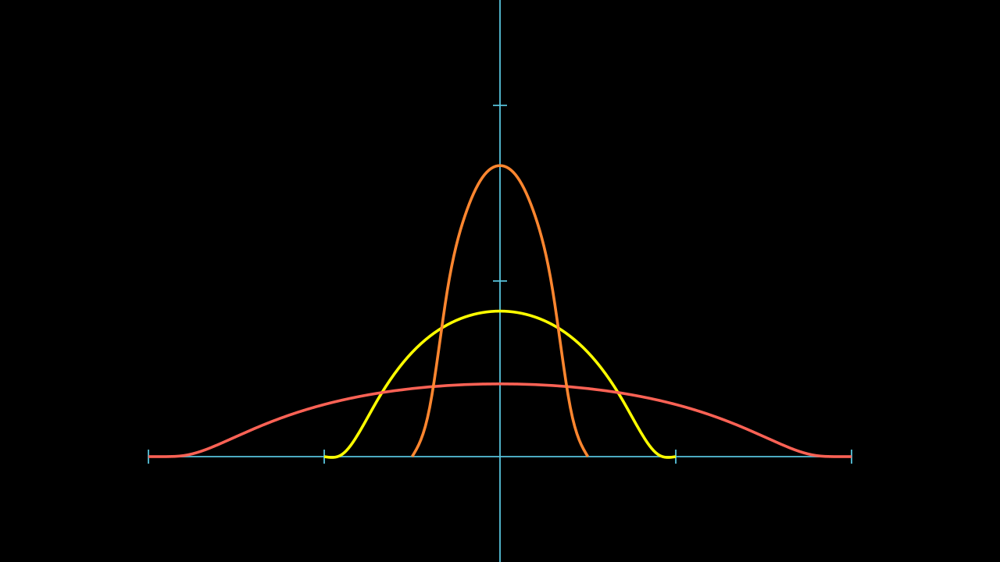

# 光滑逼近 Approximation

## 磨光子 Mollifier

我们在 **实分析** ，**泛函分析** 中早已介绍过磨光子，

$$ \eta(x) = \begin{cases}
    C e^{\frac{1}{|x|^2-1}} & if \; |x| < 1 \\
    0                       & if \; |x| \ge 1
\end{cases} $$

\(\eta\) 是光滑的，且 \(\int_{R^n} \eta = 1\)

对于 \(\epsilon > 0\) ， 令

$$ \eta_\epsilon = \frac{1}{\epsilon^n}  \eta(\frac{x}{\epsilon}) $$

我们有 \( \eta_\epsilon \in C^\infty\) ，

$$ \int_{R^n} \eta_\epsilon = 1 \quad \text{supp} (\eta_\epsilon) \subset B(0, \epsilon) $$

## Urysohn 引理

令 \(U, V\) 是 \(R^n\) 中的开集，\(V \subset\subset U\)。
则存在一个光滑函数 \(\zeta\) 使得 \(\zeta(x) \equiv 1, x\in V\)，\(\zeta(x) = 0, x \text{  near  } U\)

**证明**

<video src="../media/videos/Sobolev/720p30/Urysohn.mp4" width="100%"  type="video/mp4" controls="controls" frameborder="0" allowfullscreen="true" webkitallowfullscreen="true" mozallowfullscreen="true" oallowfullscreen="true" msallowfullscreen="true"></video>

因为 \(\overline{V} \subset \Omega\)，故存在 \(\epsilon_0 > 0\) ，使得 \(\text{dist}(\overline{V}, \partial\Omega) > 2\epsilon_0\)。      
那么令 \(W = \{x: \text{dist}(x, \overline{V}) < \epsilon_0 \}\)，则 \(W\) 是一个开集，且 \(V \subset\subset W \subset\subset \Omega\)。

令 \(\eta(x)\) 是 **磨光函数**，\(\eta_\epsilon(x) = \frac{1}{\epsilon^n} \eta(\frac{x}{\epsilon})\) ，  \(\int_\Omega \eta_\epsilon = 1\)     
那么令 \(0 < \epsilon < \epsilon_0\)，  \(\zeta=\eta_\epsilon * \chi_W \)， \(\zeta\) 是一个光滑函数，且 \(0 \le \zeta(x) \le 1, x\in \Omega\)

当 \(x\in V\) 时，\(B(x, \epsilon) \subset W\)

$$ \zeta(x) = \int_{B(0, \epsilon)} \chi_W (x-y) \eta_\epsilon(y) dy =  \int_{B(x, \epsilon)} \chi_W (y) \eta_\epsilon(x-y) dy =  \int_{B(0, \epsilon)} 1 \eta_\epsilon(y) dy = 1 $$

当 \(x\to \partial \Omega\) 时，\(\text{dist}(x, \overline{V}) > 2\epsilon\)， \(B(x, \epsilon) \subset W^c\)，同理得 \(\zeta(x) = 0\)

## 单位分解定理 Partition of Unity

### 有限版本

设 \(U\) 有界且 \(U \subset\subset \bigcup_{i=1}^N V_i\)， 其中 \(V_i\) 是开集， 那么存在 \(\zeta_i \in C^\infty, i=1, \dots, N\) 使得

$$ \begin{cases}
    0 \le \zeta_i \le 1, \quad \text{supp}(\zeta_i) \subset V_i \quad (i=1, \dots, N) \\
    \sum_{i=1}^N \zeta_i(x) = 1,  \quad x \in U
\end{cases} $$

**证明**

因为 \(U \subset\subset \bigcup_{i=1}^N V_i\)，其中 \(V_i\) 是开集，        
我们可以找到 \(W_i \subset\subset V_i\)，
使得 \(U \subset\subset \bigcup_{i=1}^N W_i \subset\subset \bigcup_{i=1}^N V_i\)。            
（由于 \(U \in R^n\) 有界，所以 \(\bar{U}\) 是紧的，每个点都有开集 \(U_x \subset\subset V_i\) 对于某个 \(i\)，\(U_x\) 是一个开覆盖，所以有有限开覆盖 \(U \subset\subset \bigcup_{i=1}^M U_{x_i}\)，将他们分组到各自属于的 \(V_i\)，令每一组的并为 \(W_i\)，则 \(U \subset\subset \bigcup_{i=1}^N W_i\)，且 \(W_i \subset\subset V_i\) ）

对于每个 \(W_i, V_i, i=1, \dots, N\)，存在 \(\phi_i \in C^\infty\) 使得

$$ \phi_i(x) = \begin{cases} 1, \quad x \in W_i \\ 0, \quad x \in V_i^c \end{cases} $$

即 \(\text{supp}(\phi_i) \subset V_i\)，
令

$$ \phi_0(x) = \begin{cases} 1, \quad x \in U \\ 0, \quad x \in \left(\bigcup_{i=1}^N W_i\right)^c \end{cases} $$

那么，令

$$ \zeta_i = \frac{\phi_i}{\sum_{i=1}^N \phi_i + 1-\phi_0}, \quad i=1, \dots, N $$

那么，\(\text{supp}(\sum_{i=1}^N \phi_i + 1-\phi_0) \supset \bigcup_{i=1}^N W_i + \left(\bigcup_{i=1}^N W_i\right)^c \supset \bigcup_{i=1}^N V_i\)，因此 \(\zeta_i\) 在 \(V_i\) 上有定义。      
又有 \(\text{supp}(\zeta_i) = \text{supp}(\phi_i) \subset V_i\)，       
而

$$ \sum_{i=1}^N \zeta_i = \sum_{i=1}^N \frac{\phi_i}{\sum_{i=1}^N \phi_i + 1-\phi_0} = \frac{\sum_{i=1}^N \phi_i}{\sum_{i=1}^N \phi_i + 1-\phi_0} = 1 \quad \text{on } U  $$

满足我们需要的条件

<video src="../media/videos/Sobolev/720p30/POU.mp4" width="100%"  type="video/mp4" controls="controls" frameborder="0" allowfullscreen="true" webkitallowfullscreen="true" mozallowfullscreen="true" oallowfullscreen="true" msallowfullscreen="true"></video>

----

我们在以上的定理当中使用了 **磨光** 的技巧，当然我们依旧更倾向于使用 **线性叠加** 的思想来理解。        
\(\eta_\epsilon * u\) 可以理解成 \(u\) 个光滑的 \(\eta_\epsilon\) 的线性组合，那么他理所当然的应该是光滑的，各阶偏导数也是光滑的。         
他还可以理解成 \(\eta_\epsilon\) 个 \(u\) 的线性组合，那么他的各阶偏导数正是 \(u\) 的各阶偏导数的线性组合。     
而当\(\epsilon \to 0\) 时，\(\eta_\epsilon * u\) 的组合越是集中，约趋向于 \(u\) 本身。

## APPROXIMATION 逼近定理

定义 \(U_\epsilon = \{x\in U | \text{dist}(x, \partial U) > \epsilon\}\).

### Local approximation 局部逼近定理 

设对于某个 \(1 \le p < \infty\)， 函数 \(u \in W^{k, p}(\Omega)\)，令

$$ u^\epsilon = \eta_\epsilon * u \quad \text{  in  } \Omega_\epsilon $$

我们有以下性质：

(i)  \(u^\epsilon \in C^\infty(\Omega_\epsilon)\)，且

(ii)

$$ D^\alpha u^\epsilon = D^\alpha \eta_\epsilon * u = \eta_\epsilon * D^\alpha u $$

且当 \(\epsilon \to 0\) 时

$$ u^\epsilon \to u \quad \text{  in  } W_{\text{loc}}^{k, p}(\Omega) 
\quad \text{i.e.} \quad 
\|u^\epsilon - u\|_{W^{k, p}(V)} \to 0 \quad  \forall V \subset\subset \Omega $$

!!! corollary

    对于一个函数 \(u \in W^{1, p}(\Omega), 1 \le p \le \infty\)，其中 \(\Omega\) 是连通开集。     
    如果 \(Du= 0 \text{ a.e. in } \Omega\)，那么存在常数 \(c\)，使得 \(u = c \text{ a.e. in } \Omega\)

    ---

    **证明**
    
    根据 局部逼近定理 ，对于任意 \(V \subset\subset \Omega\)，
    \(u^\epsilon \in C^{\infty}(V)\).        
    但是 对于 \(x\in V\)

    $$ \begin{align}
        Du^\epsilon(x) &= D(\eta_\epsilon * u)(x) \\
        &= (\eta_\epsilon * Du)(x) \\
        &= \int_{B(x, \epsilon)} \eta_\epsilon(x-y) Du(y) dy \\
        &= 0
    \end{align} $$

    那么 \(u^\epsilon = c(\epsilon) \; \forall x \in V\)
    
    又因为 \(u^\epsilon  \to u \in W^{1, p}(V)\)，故 \(u = c \; \text{a.e. in } V\)。           
    因为 \(V\) 在连通域上是任意的，所以 \(u = c \; \text{a.e. in } \Omega\) 

-----

## Problems

!!! Question

    假设 \(1 < p \le \infty\) 并且 U 有界

    (a) 如果 \(u \in W^{1,p}(U)\)，那么 \(|u| \in W^{1,p}\)
    (b) 如果 \(u \in W^{1,p}(U)\)，那么 \(u^+， u^- \in W^{1,p}\)，且

    $$ \begin{gather*}
        Du^+(x) = \begin{cases}
            Du(x), &\text{a.e. when } u(x) > 0 \\
            0, &\text{a.e. when } u(x) \le 0
        \end{cases}     \\
        Du^-(x) = \begin{cases}
            0, &\text{a.e. when } u(x) \ge 0 \\
            -Du(x), &\text{a.e. when } u(x) < 0
        \end{cases}
    \end{gather*} $$

    (c) 如果 \(u \in W^{1,p}(U)\)，那么

    $$ Du(x) = 0  \text{a.e. when} u(x) = 0 $$