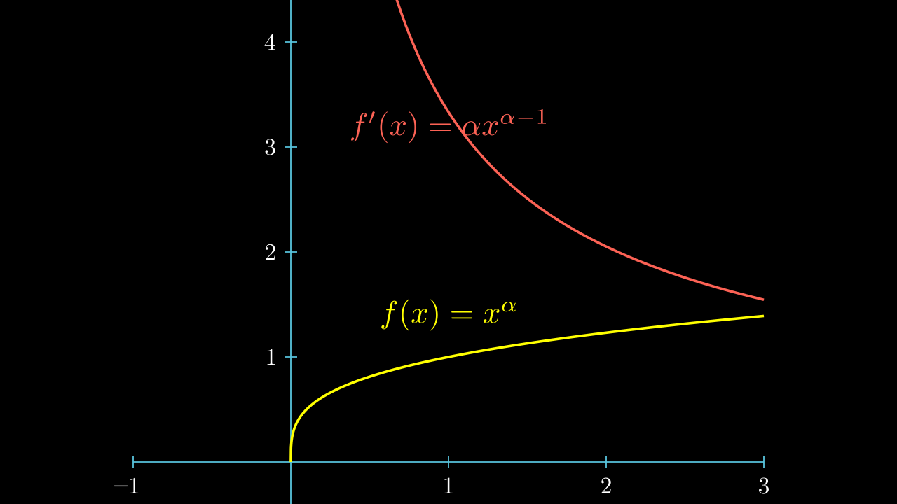

# Hölder 空间

上一节我们提到，我们希望研究一些更具有 **正则性** 的函数。      
比连续函数 \(C(\Omega)\) 更好的是什么呢？       
当然，如果函数可导，即 \(C^1(\Omega)\)，他显然比连续函数更 “光滑”。

那么有没有比 \(C^1(\Omega)\) 稍微差一点，但比 \(C^0(\Omega)\) 更好一点函数呢？     

回顾数学分析，我们曾了解过 **一致连续** 的概念，他比连续性要更强一点。      
虽然 Lipshitz 函数是一致连续的，但他的要求好像有点太强了。

!!! tip

    我们一定在学习数学分析的时候遇到过这个习题：    
    证明 \(f(x)=x^\alpha, 0<\alpha<1\)，在 \([0, T]\) 上是一致连续的，但不是 Lipshitz 连续的。

    

    我们是如何证明的这一结论的？

    对于 \(\forall \epsilon>0\)，令 \(0 < \delta < \epsilon^{1/\alpha}\)。      
    那么对于任意的 \(x, y\) 满足 \(x <y , |x-y|<\delta\)，有

    $$ |f(x)-f(y)| = |y^\alpha - x^\alpha| = |(x+\delta)^\alpha - x^\alpha| 
    \le \delta^\alpha < \epsilon $$
        
    我们是如何刻画他的连续性的？      

    $$ |f(x)-f(y)| < C|x-y|^\alpha $$

    而这正是我们期望的。

## Hölder 范数

我们知道，对于连续函数 \(u\in C^0(\Omega)\)，我们可以定义范数

$$ \|u\|_{C^0(\Omega)} \triangleq \sup_{x\in \Omega} |u(x)| $$

若 \(\|u\|_{C^0(\Omega)} < \infty\)，则 \(u\) 一致有界，故 \(u\in C^0(\bar{\Omega})\)。

以这个范数定义的空间 \(C^0(\bar{\Omega})\) 是 Banach 空间（熟知）。     
所以后面就可以用 \(\bar{\Omega}\) 来替代 \(\Omega\) ，当然也可以不替换。

但现在我们考虑的函数更好一些，对于某个 \(0< \gamma< 1\)，存在一个常数 \(C\) 满足

$$ |u(x)-u(y)| \le C|x-y|^\alpha $$

那么我们定义

$$ [u]_{C^{0, \gamma}(\Omega)} \triangleq \sup_{x,y\in \Omega \; x\neq y} \frac{|u(x) - u(y)|}{|x-y|^\gamma} $$

满足 \( [u]_{C^{0, \gamma}(\Omega)} < \infty \) 的函数我们称其为 **Hölder 连续** 函数。

我们发现 \( [u]_{C^{0, \gamma}(\Omega)} \le 0 \) 显然是其次的，且满足三角不等式：

$$ |(f+g)(x)-(f+g)(y)|  \le |f(x)-f(y)| + |g(x)-g(y)| $$

则

$$ \begin{align}
    [f+g]_{C^{0, \gamma}(\Omega)} &= \sup_{x,y\in \Omega \; x\neq y} \frac{|(f+g)(x) - (f+g)(y)|}{|x-y|^\gamma} \\
    & \le \sup_{x,y\in \Omega \; x\neq y} \frac{|f(x) - f(y)| + |g(x) - g(y)|}{|x-y|^\gamma} \\
    & \le \sup_{x,y\in \Omega \; x\neq y} \frac{|f(x) - f(y)|}{|x-y|^\gamma} + \sup_{x,y\in \Omega \; x\neq y} \frac{|g(x) - g(y)|}{|x-y|^\gamma} \\
    &\le [f]_{C^{0, \gamma}(\Omega)} + [g]_{C^{0, \gamma}(\Omega)}
\end{align} $$

但是可能存在 \(u(x) = C \neq 0\)， 使得 \([u]_{C^{0, \gamma}(\Omega)} = 0\)。      
我们将这样的 \([]\) 的映射称为 **半范数** ( semi-norm )。

!!! footnote
    但是对于 \(C_c(\Omega)\) 中的函数， \([\cdot]\) 就是范数了。

而我们想要研究的，就是 \( \|u\|_{C^{0}(\Omega)} < \infty, [u]_{C^{0, \gamma}(\Omega)} < \infty \) 的函数。

那么我们就粗暴的直接加起来，定义

$$ \|u\|_{C^{0, \gamma}(\Omega)} \triangleq  \|u\|_{C^{0}(\Omega)} + [u]_{C^{0, \gamma}(\Omega)} , \quad \gamma \in (0, 1] $$

而他是一个范数，因为 一个范数加一个半范数还是一个范数。

那么对于某个 \(0<\gamma\le 1\) 我们 **定义** Hölder 空间 \(C^{0, \gamma}(\Omega)\)  是所有 \(\|u\|_{C^{0, \gamma}(\Omega)} < \infty\) 的函数构成的集合。

$$ C^{0, \gamma}(\Omega) \triangleq \{ u : \|u\|_{C^{0, \gamma}(\Omega)} < \infty \} $$

类似的，对于某个 \(k\in Z_+\)，我们还可以构造比 \(C^k(\Omega)\) 正则性好一点的空间，       
即 \(k\) 阶导数 Hölder 连续的函数，并定义范数

$$ \|u\|_{C^{k, \gamma}(\Omega)} \triangleq  \sum_{|\alpha| \le k} \|D^\alpha u\|_{C^{0}(\Omega)} + \sum_{|\alpha| = k}[D^\alpha u]_{C^{0, \gamma}(\Omega)} $$

以及

$$ C^{k, \gamma}(\Omega) \triangleq \{ u : \|u\|_{C^{k, \gamma}(\Omega)} < \infty \} $$

## Completeness 完备性

**证明 \(C^{k, \gamma}(\Omega)\) 是 Banach 空间。**         

我们分三步来证明：

- \(C^0(\Omega)\) 是完备的。
- \(C^{1}(\Omega)\) 是完备的。
- \(C^{0, \gamma}(\Omega)\) 是完备的。
- 由数学归纳法，推出 \(C^{k, \gamma}(\Omega)\) 是 完备空间。

**1**.  

若一个连续函数序列 \(\{u_n\}\) 是 \(C^0(\Omega)\) 中的 Cauchy 列，即

对 \(\forall \epsilon>0\)，存在 \(N\) 使得，
对 \(n, m \ge N\) 满足

$$ \|u_n-u_m\|_{C^0(\Omega)} = \sup_{x \in \Omega} |u_n(x)-u_m(x)| \le \epsilon $$

那么对于每个固定的 \(x\in \Omega\)，\(\{u_n(x)\}\) 是 \(R\) 中的 Cauchy 列，   
所以是收敛序列，设其收敛到 \(u(x)\)。

那么就有 \(\{u_n\}\) 收敛到 \(u\)，而且是 **一致收敛**。        
而连续函数一致收敛到的极限也是连续的，所以 \(u\) 也是连续的。

$$ \sup_{x\in \Omega} |u(x)| \le \sup_{x\in \Omega} |u_n(x)| + \epsilon <\infty $$

故 \(u\) 一定是 \(C^0(\Omega)\) 中的一个函数。      

而 Cauchy 列比有界，所以 \(\|u_n\|_{C^0(\Omega)}\) 一致有界，

**2**.

若一个函数序列 \(\{u_n\}\) 是 \(C^1(\Omega)\) 中的 Cauchy 列，即

对 \(\forall \epsilon>0\)，存在 \(N\) 使得，
对 \(n, m \ge N\) 满足

$$ \|u_n-u_m\|_{C^0(\Omega)} + \sum_{|\alpha| = 1} \|D^\alpha u_n\|_{C^0(\Omega)} \le \epsilon $$

那么，\(\{u_n\}, \{D^\alpha u_n\}\) 也是 \(C^0(\Omega)\) 中的 Cauchy 列，所以是收敛序列。       
设 

$$ \lim_{n\to \infty} u_n = u，\quad \lim_{n\to \infty} D^\alpha u_n = v_\alpha $$

且 \(u, v_\alpha \in C^0(\Omega)\) ，
\(\{u_n\}, \{D^\alpha u_n\}\) 是一致有界的。

若 \(y \in B(x, \epsilon) \cap \Omega, y\neq x\)，   
则由控制收敛定理，有

$$ \begin{align}
    u(y)-u(x) &= \lim_{n\to \infty} u_n(y)-u_n(x) \\
    &= \lim_{n\to \infty} u_n(x+y-x) - u_n(x) \\
    &= \lim_{n\to \infty} \int_{0}^{1} \frac{d}{dt}u_n(x + t(y-x)) dt  \\
    &= \lim_{n\to \infty} \int_{0}^{1} D u_n(x + t(y-x)) \cdot (y-x) dt  \\
    % &= \int_{0}^{1}  \sum_{|\alpha| = 1} D^\alpha u_n(x + t(y-x)) \nu_\alpha dt  \\
    &= \int_{0}^{1} v(x + t(y-x)) \cdot (y-x) dt  \\
\end{align} $$

当 \(\epsilon \to 0\) 时， 由  \(v\) 的连续性，\(v(x + t(y-x))\) 一致趋向于 \(v(x)\)，      
因此 \(u(x)\) 可微，

$$ u(y)-u(x) = v(x) \cdot (y-x)  + o(|y-x|) $$

所以 \(D^\alpha u(x) = v_\alpha(x)\)，
即

$$ u \in C^1(\Omega) $$

**3**.

若一个函数序列 \(\{u_n\}\) 是 \(C^{0, \gamma}(\Omega)\) 中的 Cauchy 列，即

对 \(\forall \epsilon>0\)，存在 \(N\) 使得，
对 \(n, m \ge N\) 满足

$$ \|u_n-u_m\|_{C^0(\Omega)} + [u_n-u_m]_{C^{0,\gamma}(\Omega)} \le \epsilon $$

那么，\(\{u_n\}\) 也是 \(C^0(\Omega)\) 中的 Cauchy 列，所以是收敛序列。 
设 \(\lim_{n\to \infty} u_n = u\)

由于 \(\{u_n\}\) 在半范数 \([]\) 下是柯西列，则他是一致有界的，     
所以存在 \(M\)， 使得 \([u_n]_{C^{0,\gamma}(\Omega)} \le M, \forall n\)。

对于固定的 \(x,y \in \Omega \; x\neq y\)，

$$ \frac{|u(x)- u(y)|}{|x-y|^\gamma} 
= \lim_{n\to \infty} \frac{|u_n(x)- u_n(y)|}{|x-y|^\gamma} 
\le \lim_{n\to \infty}[u_n]_{C^{0,\gamma}(\Omega)} \le M  $$

因此

$$ [u]_{C^{0, \gamma}(\Omega)} = \sup_{x,y\in \Omega \; x\neq y} \frac{|u(x)- u(y)|}{|x-y|^\gamma} \le M $$

故 \(u \in C^{0, \gamma}(\Omega)\) ，\(C^{0, \gamma}(\Omega)\) 完备。

**4**.

若函数列 \(\{u_n\}\) 是 \(C^{k, \gamma}(\Omega)\) 中的 Cauchy 列，即

对 \(\forall \epsilon>0\)，存在 \(N\) 使得，
对 \(n, m \ge N\) 满足

$$ \|u_n-u_m\|_{C^0(\Omega)} + \sum_{|\alpha| \le k} \|D^\alpha u_n\|_{C^0(\Omega)} + \sum_{|\alpha| = k}[D^\alpha u_n]_{C^{0,\gamma}(\Omega)} \le \epsilon $$

那么，\(\{u_n\}\) 也是 \(C^1(\Omega)\) 中的 Cauchy 列。 利用（2），    
设 \(\lim_{n\to \infty} u_n = u\)，
\(u \in C^1(\Omega)\)。

而对于 \(\{D^\alpha u_n\}, |\alpha|=1\)， 他也是 \(C^1(\Omega)\) 中的 Cauchy 列。       
则 \(D^\alpha u \in C^1(\Omega), |\alpha|=1\)，这说明 \(u\in C^2(\Omega)\)。

以此类推，由数学归纳法，        
对于 \(\{D^\alpha u_n\}, |\alpha|=k-1\)， 他也是 \(C^1(\Omega)\) 中的 Cauchy 列。       
则 \(D^\alpha u \in C^1(\Omega), |\alpha|=k-1\)，这说明 \(u\in C^k(\Omega)\)。

最后，对于 \(\{D^\alpha u_n\}, |\alpha|=k\)， 他也是 \(C^{0,\gamma}(\Omega)\) 中的 Cauchy 列。利用 （3），       
\(D^\alpha u \in C^{0,\gamma}(\Omega), |\alpha|=k\)，这说明 \(u\in C^{k, \gamma}(\Omega)\)。

因此 \(C^{k, \gamma}(\Omega)\) 完备，是 Banach 空间。

## Hölder 插值不等式 interpolation inequality

设 \(0< \beta<\gamma\le 1\)，证明

$$ \|u\|_{C^{0, \gamma}(\Omega)} \le \|u\|_{C^{0, \beta}(\Omega)}^{\frac{1-\gamma}{1-\beta}} \|u\|_{C^{0, 1}(\Omega)}^{\frac{\gamma-\beta}{1-\beta}} $$

!!! footnote
    这是一个失败的尝试。

    设 \(0< \beta<\gamma < \alpha \le 1\)，
    对于 \(x, y \in \Omega, x \neq y\)，
    由 Hölder 不等式

    $$ \frac{1}{|x-y|^{\gamma}} 
    \le \frac{\alpha-\gamma}{\alpha-\beta} \frac{1}{|x-y|^{\beta}} + \frac{\gamma-\beta}{\alpha-\beta} \frac{1}{|x-y|^{\alpha}}  $$

    故

    $$ \begin{gather*}
        \sup_{x,y\in \Omega \; x\neq y} \frac{|u(x)-u(y)|}{|x-y|^{\gamma}} 
    \le \frac{\alpha-\gamma}{\alpha-\beta} \sup_{x,y\in \Omega \; x\neq y} \frac{|u(x)-u(y)|}{|x-y|^{\beta}} 
    + \frac{\gamma-\beta}{\alpha-\beta} \sup_{x,y\in \Omega \; x\neq y} \frac{|u(x)-u(y)|}{|x-y|^{\alpha}}  \\
    \Rightarrow  \\
    \|u\|_{C^{0, \gamma}(\Omega)} 
    \le \frac{\alpha-\gamma}{\alpha-\beta}\|u\|_{C^{0, \beta}(\Omega)} 
    + \frac{\gamma-\beta}{\alpha-\beta} \|u\|_{C^{0, \alpha}(\Omega)} 
    \end{gather*} $$

设 \(0< \beta<\gamma < \alpha \le 1\)，
对于 \(x, y \in \Omega, x \neq y\)，记 

$$ \frac{\alpha-\gamma}{\alpha-\beta} = \theta, \frac{\gamma-\beta}{\alpha-\beta} = 1-\theta$$

则，\(\gamma = \theta \beta + (1-\theta) \alpha \)，那么由 Hölder 不等式

$$ \begin{split}
    &\|u\|_{C^0(\Omega)} + \frac{|u(x)-u(y)|}{|x-y|^{\gamma}} 
    = \|u\|_{C^0(\Omega)}^{ \theta + 1-\theta} + \frac{|u(x)-u(y)|^{ \theta + 1-\theta}}{|x-y|^{\theta \beta + (1-\theta) \alpha}} \\
    &\le \left( \|u\|_{C^0(\Omega)} + \frac{|u(x)-u(y)|}{|x-y|^{\beta}} \right)^\theta 
    \left( \|u\|_{C^0(\Omega)} + \frac{|u(x)-u(y)|}{|x-y|^{\alpha}} \right)^{1-\theta} \\
\end{split}  $$

那么 

$$ \begin{align}
    \|u\|_{C^{0, \gamma}(\Omega)} 
    &= \sup_{x,y\in \Omega \; x\neq y} \{\|u\|_{C^0(\Omega)} + \frac{|u(x)-u(y)|}{|x-y|^{\gamma}} \} \\
    &\le \left(\sup_{x,y\in \Omega \; x\neq y} \{ \|u\|_{C^0(\Omega)} + \frac{|u(x)-u(y)|}{|x-y|^{\beta}} \}  \right)^\theta 
    \left( \sup_{x,y\in \Omega \; x\neq y} \Big\{ \|u\|_{C^0(\Omega)} + \frac{|u(x)-u(y)|}{|x-y|^{\alpha}} \Big\} \right)^{1-\theta} \\
    &= \|u\|_{C^{0, \beta}(\Omega)}^{\theta} \|u\|_{C^{0, \alpha}(\Omega)}^{1-\theta} 
\end{align} $$

令 \(\alpha = 1\)，就是原命题。

