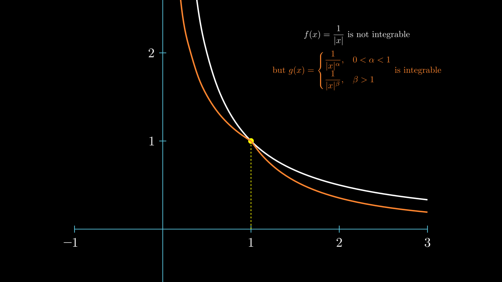

# Sobolev 不等式 \(\mathbf{I}\)

查看 [Lawrence C.Evans Partial differential equations 5.6][Evans],    
以及 [Functional Analysis, Sobolev Spaces and Partial Differential Equations 9.3][Brezis]，     
Brezis 书中的内容比较丰富，全面。

我们在这一部分的目标是发现各种Sobolev空间到其他空间的嵌入。         
这里的关键分析工具将是某些所谓的 **Sobolev 型不等式**，我们将在下面对  **光滑函数** 进行证明。     
这将建立任意函数在各种相关 Sobolev 空间中的估计。   
因为正如我们在 [逼近](Approximation.md) 中所看到的，光滑函数 是稠密的。

## 问题

为了清楚的表达，我们首先只考虑 Sobolev 空间 \(W^{1, P} ( \Omega )\)，
并提出如下基本问题：    
如果一个函数 \(u\) 属于 \(W^{1, P} ( \Omega )\)，那么 \(\Omega\) 是否自动属于某个其他空间?（我们称之为 **嵌入** embedded ）   

我们在这里应当做出提醒，这些对 \(W^{1,p}(\Omega)\) 建立的不等式，根据 \(\Omega = \mathbb{R}^n\) 还是有界开集的不同而有很大差别。

## n=1

在对一般的 \(\mathbb{R}^n\) 分析前，我们不妨先研究一下 \(n=1\) 的情况。

参考 [Brezis - Functional Analysis, Sobolev Spaces and Partial Differential Equations 8.2 The Soblev Space \(W^{1, p}(I)\) Theorem 8.2](../../Library/Brezis%20-%202011%20-%20Functional%20Analysis,%20Sobolev%20Spaces%20and%20Partial%20Di.pdf)

\(u\) 貌似跟 \(\int_0^x Du\) 差不多。其实我们有如下定理

!!! Theorem

    

    对于某个 \(1\le p \le \infty\)，若 \(u\in W^{1, p}(\Omega)\)， \(\Omega \subseteq R\) 是某个开区间，      
    则存在 点 \(x_0 \in \Omega\) 和常数 \(c\)  满足，使得

    $$ u(x) = c + \int_{x_0}^x Du, \text{ a.e.} \quad x\in \Omega $$

    1 . 这也意味着， \(u\) 和一个连续函数几乎处处相等，而 \(u\in W^{1, p}(\Omega)\)，那么个连续函数也属于 \(W^{1, p}(\Omega)\)。我们称这是 \(u\) 的一个连续版本，并且以后我们将不再区分这两个函数。

    2 . \(u(x)\) 几乎处处可导，且 \(u' = Du \text{ a.e.}\)。

    

**证明**

由于 \(v \in L^p(\Omega)\)，那么 \(v \in L_{\text{loc}}^1(\Omega)\)。       
我们令

$$ v(x) = \int_{x_0}^x Du $$

则 \(v(x) \le \int_\Omega |Du|\)，一致有界，故 \(v\in L_{\text{loc}}^1(\Omega)\)。

**1**.

下面我们证明，对于一个有界区间 \(W \subset \Omega\)， \(v\) 在 \(W\) 上是 **绝对连续函数** 。

 [周民强 实变函数论 5.4 绝对函数与微积分基本定理 定理 5.10][Zhou] ）

这是因为可积函数可被光滑函数逼近，即 \(C_c^\infty(\Omega)\) 在 \(C^p(\Omega), 1\le p < \infty\) 中稠密。            
（参考 [Folland Real Analysis Proposition 8.17](../../Library/[Gerald_B._Folland]_Real_Analysis__Modern_Techniq.pdf)     
[Lawrence C.Evans Partial differential equations Appendix C.5][Evans]）     

对于 \(\forall \epsilon > 0\)，存在连续函数 \(g \in C_c^\infty(W)\)，使得 \(\int_W |u(x) - g(x)| dx < \epsilon/2\)。     
而对于 \(Dg\) 他在紧集上连续，那么他有界，\(g\) 是 Lipschitz 连续的，\( |g(x)-g(y)| \leq L(|x-y|)\)。        
因此， 若 \(0<\delta < \dfrac{\epsilon}{2L}, \)，         
那么对于任意有限个互不相交的开区间 \((x_i, y_i) \subset W, i=1,2,\cdots,n\) 满足 \(\sum_{i=1}^n (y_i-x_i)<\delta\) 时，有

$$ \begin{align}
    \sum_{i=1}^n |v(y_i)-v(x_i)| 
    & \leq \sum_{i=1}^n |v(y_i)-v(x_i) - g(y_i)+g(x_i)| + \sum_{i=1}^n |g(y_i)-g(x_i)| \\
    & \leq \int_W |v-g| + \sum_{i=1}^n L|y_i-x_i| \\
    & \leq \frac{\epsilon}{2} + L \delta        \\
    & \leq \frac{\epsilon}{2} + L \frac{\epsilon}{2L} = \epsilon  \\
\end{align}. $$

故 \(v\) 在 \(\Omega\) 的任意有界子集上绝对连续。

那么他 **几乎处处可导** 。（ [周民强 实变函数论 5.4 绝对函数与微积分基本定理 推论 5.12][Zhou] ）         
那么 \(v' = Du \text{ a.e.}\)  （ [周民强 实变函数论 5.3 不定积分的微分 定理 5.7][Zhou] ）

**2**.

[Brezis - Functional Analysis, Sobolev Spaces and Partial Differential Equations 8.2 The Soblev Space \(W^{1, p}(I)\) Lemma 8.2][Brezis]

我们证明 \(D(u-v) = 0 \text{ a.e.}\)。

我们这里扩大了 \(\phi\) 的选择空间。        
对任意的 \(\phi \in C_c^1(\Omega)\)，

$$ \begin{align}
    \int_\Omega v \phi'
    &= \int_\Omega \phi' \int_{x_0}^x Du \\
\end{align}  $$

那么由 可积函数的 **分部积分定理**

!!! Lemma

    证明参考 [周民强 实变函数论 5.5 分部积分与积分中值定理 定理 5.15][Zhou]

    若 \(f(x), g(x)\) 皆为 \([a,b]\) 上的可积函数，\(\alpha, \beta \in R\)，令

    $$ F(x) = \alpha + \int_a^x f(t)dt, \quad G(x) = \beta + \int_a^x g(t)dt $$

    则

    $$ \int_a^b G(x)f(x)dx + \int_a^b g(x)F(x)dx = F(b)G(b) - F(a)G(a) $$

\(\phi', Du\) 可积，则

$$ \begin{align}
    \int_\Omega v \phi'
    = \int_\Omega \phi' \int_{x_0}^x Du 
    = v \phi \Big|_{\partial \Omega} - \int_\Omega \phi Du 
    = - \int_\Omega \phi Du 
\end{align}  $$

因此 \(Du\) 是 \(v\) 的弱导数，那么由于弱导数线性原理 \(D(u-v) = 0 \text{ a.e. }\)          
所以 \(v, u-v \in W_{\text{loc}}^{1,p}(\Omega)\)

**3**.

由于 \(u-v \in W_{\text{loc}}^{1,p}(\Omega)\)，
而 \(D(u-v) = 0 \text{ a.e. }\)，我们希望 \(u = c \text{ a.e. }\)

这里可以使用 [局部逼近定理](./Approximation.md#local-approximation) 的 Corollary，但这里给出一个一维的证明。

参考 [Hunter Hunter Notes on PDE Proposition 3.6][Hunter]      
[Brezis - Functional Analysis, Sobolev Spaces and Partial Differential Equations 8.2 The Soblev Space \(W^{1, p}(I)\) Lemma 8.1][Brezis]

!!! Lemma

    设 \(f \in L_{\text{loc}}^1(\Omega)\) ， \(\Omega \subset R\) 是一个区间 ，满足

    $$ \int_\Omega f  \phi' dx = 0 \; \forall \phi \in C_c^1(\Omega) $$

    那么存在常数 \(c\) 使得 \(f = c \text{ a.e. }, x \in \Omega \)

    ----

    固定 \(\eta \in C_c(\Omega), \int_{\Omega} \eta = 1\)。      
    对于任何函数 \(\phi \in C_c(\Omega)\)，令

    $$ h(x) = \phi(x) - (\int_\Omega \phi )\eta(x) $$

    那么 
    
    $$ \int_\Omega h = \int_\Omega \phi - (\int_\Omega \phi )\int \eta(x) = 0 $$

    因此对 \(h\) 进行积分

    $$ H(x) = \int_{-\infty}^x h(t) $$

    那么 \(H(x)\in C_c^1(\Omega) \)

    根据题目条件，我们有

    $$ \begin{align}
        0 &= \int_\Omega f H' = \int_\Omega f(x) \left[ \phi(x) - (\int_\Omega \phi )\eta(x) \right] \\
        &= \int_\Omega f \phi - (\int_\Omega f \eta) (\int_\Omega \phi)      \\
        &= \int_\Omega \left[f  - (\int_\Omega f \eta)\right] \phi      \\
    \end{align} $$

    那么由 [内积任何测试函数 0，则几乎处处为零](../../RealAnalysis/Approximation/index.md) 可知

    $$ f - (\int_\Omega f \eta) = 0 \text{ a.e. } $$

那么，由 2 以及 [光滑函数一致逼近连续函数] ，对于任何 \(\phi\in C_c^1(\Omega)\)，

$$ \int_\Omega (u-v) \phi' = - \int \phi Du + \int \phi Dv = \int \phi (Du - Dv) = 0 $$

那么存在 \(c\) 使得 \(u-v = c \text{ a.e. }\) ， 即

$$ u(x) = c + \int_{x_0}^x Du \text{ a.e. } $$

其中 \( v(x)=c+\int_{x_0}^x Du = c+\int_{x_0}^x v' \text{ a.e. } \)，
\(v' = Du \text{ a.e. }, v = u \text{ a.e. } \)，       
故 \(v \in W^{1,p}(\Omega)\)。

此后不再区分 \(u, v\)，默认 \(u\) 是连续版本。

!!! Proposition

    对于 \( 1 < p <\infty\)，

    $$ \begin{align}
        |u(x)-u(y)| \le \int_x^y 1 \cdot | Du | \le (\int_x^y 1^{\frac{p}{p-1}})^{\frac{p-1}{p}} (\int_x^y |Du|^p)^{\frac{1}{p}} = |x-y|^{1-\frac{1}{p}} \|Du\|_{L^p(\Omega)}
    \end{align} $$

----

## 直观理解

对于一般的 \(\mathbb{R}^n, n\ge 1\)，
对于建立不等式的动机，两本书中都提到了用伸缩变换发现的参数，但这里我们给出另一种直观上的理解。

!!! view

    对于某个函数的可积性，我们常常通过将其与函数

    $$ u(x) = \frac{1}{|x|} $$

    进行比较来获得，

    

    如果对于某个这样的 \(g\) 和常数 \(C\)，有 \(h=Cg\)，我们记他满足 \(h \prec  \dfrac{1}{|x|}\)        
    我们用类似 \(h\) 这样的“测试函数”，来对 \(u \in W^{1, p} (\mathbb{R}^n)\) 如何被 \(Du\) 控制进行粗略的把握。         

    如果 \(h \in W^{1,p}(\mathbb{R}^n)\)，那么

    $$ \begin{gather}
        \int |Dh|^p = n\alpha(n)\int_0^\infty |Dh(r)|^p r^{n-1} dr  \\
        \int |h|^p = n\alpha(n)\int_0^\infty |h(r)|^p r^{n-1} dr
    \end{gather}  $$

    其中， \(\alpha(n)\) 代表 \(n\) 维单位球的体积，而 \(n\alpha(n)\) 等于 \(n\) 维单位球的表面积。

    为了满足可积性，可以有 

    $$ \begin{gather}
        |Dh(r)|^pr^{n-1} \prec \dfrac{1}{|r|}   \\
        |h(r)|^pr^{n-1} \prec \dfrac{1}{|r|}
    \end{gather} $$

    那么有 

    $$ \begin{gather}
        Dh(r) \prec \dfrac{1}{|r|^{n/p}}    \\
        h(r) \prec \dfrac{1}{|r|^{n/p}}
    \end{gather} $$

    那么积分回去有

    ### case1

    对于 \(1 \le p < n\)

    $$ h(r) \prec \begin{cases}
        \dfrac{1}{|r|^{n/p-1}}, & \text{if } r \in (0, 1), \\
        \dfrac{1}{|r|^{n/p}}, & \text{if } r \ge 1.
    \end{cases} $$

    现在我们观察 \(\int |h|^q\)，有

    $$ \int |h|^q = n\alpha(n)\int_0^\infty |h|^q r^{n-1} dr $$

    如果 \(q(\frac{n}{p}-1)\le n, \quad \text{and} \quad q\frac{n}{p} \ge n\)，即

    $$ \frac{1}{p} - \frac{1}{n} \le \frac{1}{q} \le \frac{1}{p}$$

    那么 \(|h(r)|^q r^{n-1} \prec \dfrac{1}{|r|} \)，\(\int |u|^q\) 就可积了。

    ### case2

    对于 \(p = n\)，

    $$ h(r) \prec \begin{cases}
        -\log |r| + C, & \text{if } r \in (0, 1), \\
        \dfrac{1}{|r|}, & \text{if } r \ge 1.
    \end{cases} $$

    继续观察 \(\int |h|^q= n\alpha(n)\int_0^\infty |h|^q r^{n-1} dr\)，     
    如果 \(q \ge n\)，\(|h|^q r^{n-1} \prec \dfrac{1}{|r|} \)，\( \int |h|^q\) 可积，       
    （ 若 \(q< n\) 则大于 1 的部分无法被控制 ）         
    能否找一个函数 \(u\) 在 \(r \le 1\) 时， \(Du\) 可积，但\(u \to \infty\) ？

    ### case3

    对于 \(p > n\)，

    $$ h(r) \prec \begin{cases}
        -|r|^{1-n/p}+C & \text{if } r \in (0, 1), \\
        \dfrac{1}{|r|^{n/p}}, & \text{if } r \ge 1.
    \end{cases} $$

    我们发现，\(h(r)\) 不仅 **有界**，而且有 Holder 连续性

    $$ |h(x) - h(y)| \prec |x-y|^{1-n/p} $$

    因为最极端的情况也只是在 \(r\to 0\) 处。

至此，我们对 \(h\) 的可积性有了直观的把握，而对于任意的 \(u \in W^{1, p} (\mathbb{R}^n)\)
他几乎处处和 \(h\) 差不多。     
（甚至沿着 [case3](#case3) 的思想我们可以获得 Morrey 不等式证明的直观理解。）

我们必然将问题分成三种情况来讨论：

$$ \begin{align}
    & 1 \le p < n,    \\
    & p = n,    \\
    & n < p \le \infty.
\end{align} $$

## Gagliardo-Nirenberg-Sobolev 不等式

对于第一种情况，我们先对 \(u\in C_c^\infty(\mathbb{R}^n)\) 进行研究。    
若 \(1\le p \le n\)， 我们能否找到特定的 \( (C, q) \) ，使得对于任意的 \(u\in C_c^\infty(\mathbb{R}^n)\) 可以建立这样的一个估计？

$$ \|u\|_{L^q(\mathbb{R}^n)} \le C \|Du\|_{L^{p}(\mathbb{R}^n)} $$

**定义**：  如果 \(1\le p < n\)，那么 \(p\) 的 Sobolev 共轭为

$$ p^* = \frac{np}{n-p} $$

!!! tip

    1 . 

    $$ \frac{1}{p^*} = \frac{1}{p} - \frac{1}{n}, \quad p^* > p $$

    若不等式成立，那么对 \(u\) 进行伸缩变换，再对不等号两边进行齐次性分析，能得出只有当 \(q = p^*\) ，不等式才有意义。
    查看教材。

    ---

    2 .         
    我们确实需要 \(u\) 具有紧支集，否则 \(u\) 随意上下移动但 \(Du\) 不变，对于范数的估计就不存在了。

!!! Theorem
    

    **Gagliardcr-Nirenberg-Sobolev inequality**

    设 \(1\le p < n\)，则存在只跟 \(p, n\) 有关的常数 \(C\)，使得对于任意的 \(u\in C_c^1(\mathbb{R}^n)\)，有

    $$ \|u\|_{L^{p^*}(\mathbb{R}^n)} \le C \|Du\|_{L^{p}(\mathbb{R}^n)} $$

    

**证明**:

[Functional Analysis, Sobolev Spaces and Partial Differential Equations 9.3 Theorem 9.9][Brezis]

**1**.      
首先考虑 \(p=1\) 的情况，因为 \(u\) 具有紧支集， 对于每个 \(i=1, \cdots, n\) 和 \(x\in \mathbb{R}^n\)，我们有

$$ u(x) = \int_{-\infty}^{x^i} D_i u(x_1, \cdots, x_{i-1}, \xi_i, x_{i+1}, \cdots, x_n) d\xi_i $$

那么就有

$$ |u| \le \int_{-\infty}^{+\infty} |D_i u(x_1, \cdots, x_{i-1}, \xi_i, x_{i+1}, \cdots, x_n)| d\xi_i $$

我们意识到上式右侧的结果与 \(x_i\) 的取值无关。
下面考虑

$$ |u|^{\frac{n}{n-1}} \le \prod_{i=1}^n \left(\int_{-\infty}^{+\infty} |D_i u(x_1, \cdots, x_{i-1}, \xi_i, x_{i+1}, \cdots, x_n)| d\xi_i \right)^{\frac{1}{n-1}} $$

我们想要估计 \(\int_{\mathbb{R}^n}|u|^{\frac{n}{n-1}}\)，那么这里我们就介绍一个重要的不等式

!!! Lemma

    对于 \(f_i \in L^{n-1}(R^{n-1}), i=1, \cdots, n\)，设

    $$ \widetilde{x_i} = (x_1, \cdots, x_{i-1}, x_{i+1}, \cdots, x_n) \in R^{n-1} $$

    令

    $$ f(x) := \prod_{i=1}^n f_i( \widetilde{x_i}) $$

    那么有

    $$ \int_{\mathbb{R}^n} |f(x)| dx = \int_{\mathbb{R}^n} \prod_{i=1}^n |f_i(\widetilde{x_i})| dx = \int_{-\infty}^{+\infty} \cdots \int_{-\infty}^{+\infty} |f_1(\widetilde{x_1})| \cdots |f_n(\widetilde{x_n})| dx_1 \cdots dx_n $$ 

    注意到 \(f_1(\widetilde{x_1})\) 与 \(x_1\) 无关，所以

    $$ \int_{\mathbb{R}^n} |f(x)| dx = \int_{R^{n-1}} dx_2 \cdots dx_n |f_1(\widetilde{x_1})| \int |f_2(\widetilde{x_2})| \cdots |f_n(\widetilde{x_n})| dx_1$$

    这时候使用广义 [Hölder 不等式](../../RealAnalysis/Inequalities/index.md#holder)

    $$ \int |f_2(\widetilde{x_2})| \cdots |f_n(\widetilde{x_n})| dx_1 \le \left(\int |f_2(\widetilde{x_2})|^{n-1} dx_1 \right)^{\frac{1}{n-1}}  \cdots 
    \left(\int |f_n(\widetilde{x_n})|^{n-1}dx_1 \right)^{\frac{1}{n-1}} $$

    我们有

    $$ \int_{\mathbb{R}^n} |f(x)| dx 
    \le  \int_{R^{n-1}} dx_2 \cdots dx_n |f_1(\widetilde{x_1})| 
    \prod_{i=2}^n \left(\int |f_2(\widetilde{x_2})|^{n-1} dx_1 \right)^{\frac{1}{n-1}} $$

    又注意到 \(\left(\int |f_2(\widetilde{x_2})|^{n-1} dx_1 \right)^{\frac{1}{n-1}}\) 与 \(x_2\) 无关，将其提出

    $$ RHS = \int_{R^{n-2}} dx_3 \cdots dx_n \left(\int |f_2(\widetilde{x_2})|^{n-1} dx_1 \right)^{\frac{1}{n-1}}
    \left( \int |f_1(\widetilde{x_1})| \prod_{i=2}^n \left(\int |f_2(\widetilde{x_2})|^{n-1} dx_1 \right)^{\frac{1}{n-1}} dx_2 \right) $$

    最后一向正好有 \(n-1\) 项，所以可以推出

    $$ \int_{\mathbb{R}^n} |f(x)| dx 
    \le  \int_{R^{n-1}} dx_3 \cdots dx_n
    \left( \left(\int |f_1(\widetilde{x_1})|^{n-1} dx_2\right)^{\frac{1}{n-1}}
    \prod_{i=2}^n \left(\int |f_2(\widetilde{x_2})|^{n-1} dx_1 dx_2 \right)^{\frac{1}{n-1}} \right) $$

    以此类推，我们得到了

    $$ \int_{\mathbb{R}^n} |f(x)| dx \le \prod_{i=1}^n \left(\int |f_i(\widetilde{x_i})|^{n-1} dx_1 \cdots dx_{i-1} dx_{i+1} \cdots dx_n \right)^{\frac{1}{n-1}} $$

    即

    $$ \|f\|_{L^1(\mathbb{R}^n)} \le \prod_{i=1}^n \|f_i\|_{L^{n-1}(R^{n-1})} $$

应用引理， 我们有

$$ \begin{align}
\int_{\mathbb{R}^n}|u|^{\frac{n}{n-1}} 
&\le \int_{\mathbb{R}^n} \prod_{i=1}^n \left(\int_{-\infty}^{+\infty} |D_i u(x_1, \cdots, x_{i-1}, \xi_i, x_{i+1}, \cdots, x_n)| d\xi_i \right)^{\frac{1}{n-1}}   \\
&\le \prod_{i=1}^n \left( \int_{\mathbb{R}^n}|D_i u| \right)^{\frac{1}{n-1}} \\
&\le \left(\int_{\mathbb{R}^n} |D u|\right)^{\frac{n}{n-1}}
\end{align}  $$

或者更精细一点 [Sobolev空间与偏微分方程引论-王术 2.2.5](../index.md#sobolev空间与偏微分方程引论-王术)

$$ \begin{align}
\int_{\mathbb{R}^n}|u|^{\frac{n}{n-1}} 
&\le \prod_{i=1}^n \left(\int_{\mathbb{R}^n} |D_i u| \right)^{\frac{1}{n-1}}
= \left( \prod_{i=1}^n \left(\int_{\mathbb{R}^n} |D_i u| \right)^{\frac{1}{n}} \right)^{\frac{n}{n-1}} \\
&\le \left( \frac{1}{n}\sum_{i=1}^n \int_{\mathbb{R}^n} |D_i u| \right)^{\frac{n}{n-1}} \\
&\le \left( \frac{1}{\sqrt{n}} \int_{\mathbb{R}^n} |D u| \right)^{\frac{n}{n-1}}
\end{align}  $$
   
后两个不等式是 几何平均 \(\le\) 算术平均 \(\le\) 平方平均。

至此我们得到了

$$ \|u\|_{L^{\frac{n}{n-1}}(\mathbb{R}^n)} \le C(n) \|Du\|_{L^{1}(\mathbb{R}^n)} $$

!!! footnote
    其他证明可以看 [Liu-2023](./Liu%20-%202023%20-%20Gagliardo-Nirenberg-Sobolev%20Inequality%20An%20Inducti.pdf)

**2**.  
对于 \(1< p < n\)，将 \(|u|\) 替换成 \(|u|^\gamma\) 来进行分析，\(\gamma\) 待定，但是希望 \(\gamma>1\)，这样可以将 \(u\) 和 \(Du\) 用 [Hölder 不等式](../../RealAnalysis/Inequalities/index.md#holder) 分离。

$$ \begin{align}
    \left( \int_{\mathbb{R}^n} |u|^{\frac{\gamma n}{n-1}} \right)^{\frac{n-1}{n}}
    & \le \int_{\mathbb{R}^n} \Big| D|u|^\gamma \Big|  =  \gamma \int_{\mathbb{R}^n} |u|^{\gamma-1} |Du| \\
    & \le \gamma \left( \int_{\mathbb{R}^n} |u|^{(\gamma-1)\frac{p}{p-1}} \right)^{\frac{p-1}{p}} \left( \int_{\mathbb{R}^n} |Du|^p \right)^{\frac{1}{p}}
\end{align} $$

这里为了让右面关于 \(u\) 的积分抵消掉，我们令 \(\frac{\gamma n}{n-1}=(\gamma-1)\frac{p}{p-1}\)，即

$$ \gamma = \frac{p(n-1)}{n-p} > 1 $$

这时，\(\frac{\gamma n}{n-1}=(\gamma-1)\frac{p}{p-1}=\frac{np}{n-p} = p^*\)，\(\frac{n-1}{n} - \frac{p-1}{p} = \frac{1}{p} - \frac{1}{n} = \frac{1}{p^*}\) 故

$$ \left(\int_{\mathbb{R}^n} |u|^{p^*}\right)^{\frac{1}{p^*}} \le \gamma \left(\int_{\mathbb{R}^n} |Du|^p\right)^{\frac{1}{p}} $$

即

$$ \begin{gather}
    \|u\|_{L^{p^*}(\mathbb{R}^n)} \le C(n,p,p^*) \|Du\|_{L^p(\mathbb{R}^n)}   \\
    \Rightarrow \\
     W^{1,p}(\mathbb{R}^n) \subset  L^{p^*}(\mathbb{R}^n)
\end{gather} $$

!!! Corollary

    [Functional Analysis, Sobolev Spaces and Partial Differential Equations 9.3 Corollary 9.10][Brezis]

    $$ \begin{cases} W^{1,p}(\mathbb{R}^n) \subset  L^{p^*}(\mathbb{R}^n) \\ W^{1,p}(\mathbb{R}^n) \subset  L^{p}(\mathbb{R}^n) \end{cases} \Rightarrow W^{1,p}(\mathbb{R}^n) \subset  L^{q}(\mathbb{R}^n), \; q\in [p, p^*] $$

    ----

    ### **插值不等式**

    $$ \|u\|_{L^q(\mathbb{R}^n)} \le \|u\|_{L^p(\mathbb{R}^n)}^{\theta}\|u\|_{L^r(\mathbb{R}^n)}^{1-\theta}, \; 
    1\le p \le q \le r \le \infty, \; 
    \frac{1}{q} = \frac{\theta}{p} + \frac{1-\theta}{r} $$

    事实上， 由于 \(1 = \frac{\theta q}{p} + \frac{(1-\theta)q}{r} \)

    $$ \begin{align}
        \int |u|^q & = \int |u|^{\theta q} |u|^{(1-\theta)q} \\
        & \le \left(\int |u|^{\theta q \frac{p}{\theta q}} \right)^{\frac{\theta q}{p}} 
            \left(\int |u|^{(1-\theta)q \frac{r}{(1-\theta) q}}\right)^{\frac{(1-\theta)q}{r}} \\
        &= \left(\int |u|^{p} \right)^{\frac{\theta q}{p}} 
            \left(\int |u|^{r}\right)^{\frac{(1-\theta)q}{r}}   \\
        &= \|u\|_{L^p}^{\theta q} \|u\|_{L^r}^{(1-\theta) q}
    \end{align} $$

    故

    $$ \|u\|_{L^q(\mathbb{R}^n)} \le \|u\|_{L^p(\mathbb{R}^n)}^{\theta}\|u\|_{L^r(\mathbb{R}^n)}^{1-\theta} $$

    ----

    由于 

    $$ \|u\|_{L^p} \le \|u\|_{W^{1,p}}  \quad \text{ and } \quad \|u\|_{L^{p^*}} \le C(n,p,p^*) \|u\|_{W^{1,p}} $$

    则

    $$ \|u\|_{L^q} \le \|u\|_{L^{p}}^{\theta} \|u\|_{L^{1,p^*}}^{(1-\theta)} \le C(n,p,p^*, q) \|u\|_{W^{1,p}} $$

    因此

    $$ W^{1,p}(\mathbb{R}^n) \subset  L^{q}(\mathbb{R}^n), \; q\in [p, p^*] $$

## 边界情况 p=n

!!! tip
    我们已经知道上一节的不等式，而且当 \(p\to n\) 时，有 \(p^* = \frac{np}{n-p} \to +\infty \)。        
    那么当 \(p=n\), \(u \in W^{1,p}(\mathbb{R}^n)\) 时，\(u\) 是否自动属于 \(L^\infty\) 呢？

    这个命题只有当 \(n=1\) 时才成立。

    $$ |u(x)| = \int_{-\infty}^x Du(t) dt \le \int_{-\infty}^{+\infty} |Du(t)| dt $$

    但是 当 \(n\ge 2\) 时，猜测 **不成立**。
    还记得我们在 [case2](#case2) 中提过的问题吗？     
    教材中考虑的 \(u = \log\log(1+\frac{1}{|x|}), x\in B(0, 1)\)， 正是满足 \(u \prec \log|x|+C\) 的一个函数。       
    <!-- 类似的，我们也可以考虑 \(u = \log \frac{1}{|x|}, x\in B(0, 1)\)。 -->

    显然，\(u\) 是无界的，但是 \(\int_{B(0, 1)} |u|^n\) 和 \(\int_{B(0, 1)} |Du|^n\) 都是有限的。       
    这是因为 

    $$ \begin{align}
        \int_{B(0, 1)} |u|^n &= \int_0^1 dr \int_{\partial B(0, r)} |u(x)|^n dx \\
        &= n\alpha(n) \int_0^1 |\log\log(1+\frac{1}{r})|^n r^{n-1} dr \\
    \end{align}$$

        
    而函数 \(|\log \log (1+\frac{1}{r})|^n r^{n-1}\) 在 \([0, 1]\) 上是有界的，所以积分有限。     
    \(Du\) 同理，

    $$ Du(x) = \frac{1}{(1+\frac{1}{|x|}) \log(1+\frac{1}{|x|})}(-\frac{1}{|x|^2}\frac{x}{|x|}) $$

    $$ \begin{align}
        \int_{B(0, 1)} |Du|^n &= \int_0^1 dr \int_{\partial B(0, r)} |Du(x)|^n dx \\
        &\le \int_0^1 dr \int_{\partial B(0, r)}  |\frac{1}{(1+\frac{1}{|x|}) \log(1+\frac{1}{|x|})}(-\frac{1}{|x|^2})|^n dx \\
        &\le n\alpha(n) \int_0^1 \left(\frac{1}{(r^2+r) \log(1+\frac{1}{r})} \right)^n r^{n-1} dr \\
        &\le C \int_0^1 \left(\frac{1}{r \log(\frac{1}{r})} \right)^n r^{n-1} dr        \\
        &= C \int_0^1 \frac{1}{\log^n r} \frac{1}{r} dr         \\
        &= C \int_1^\infty \frac{1}{t^n} dt    <  \infty
    \end{align} $$

    所以 \(u\) 属于 \(W^{1,n}(B(0, 1))\)，但不属于 \(L^\infty(B(0, 1))\)。

!!! Theorem

    

    事实上我们有满足我们最开始猜测的估计    
    [Functional Analysis, Sobolev Spaces and Partial Differential Equations 9.3 Corollary 9.11][Brezis]

    $$ \begin{gather*}
        \|u\|_{L^q(\mathbb{R}^n)} \le C(n, q) \|u\|_{W^{1, n}(\mathbb{R}^n)} \\
        \text{ i.e. } \quad W^{1,n}(\mathbb{R}^n) \subset  L^q(\mathbb{R}^n), \quad n \le q < \infty
    \end{gather*} $$

    

**证明**:

回到 [Gagliardo-Nirenberg-Sobolev 不等式](#gagliardo-nirenberg-sobolev) 证明的最后一步

对 \(\gamma > 1\)，

$$ \begin{gather*}
    \left( \int_{\mathbb{R}^n} |u|^{\frac{\gamma n}{n-1}} \right)^{\frac{n-1}{n}}
    \le \gamma \left( \int_{\mathbb{R}^n} |u|^{(\gamma-1)\frac{p}{p-1}} \right)^{\frac{p-1}{p}} \left( \int_{\mathbb{R}^n} |Du|^p \right)^{\frac{1}{p}}   \\
    \text{i.e. }    \\
    \|u\|_{L^{\frac{\gamma n}{n-1}}(\mathbb{R}^n)}^{\gamma} \le C(n, p, \gamma) \|u\|_{L^{(\gamma-1)\frac{p}{p-1}}(\mathbb{R}^n)}^{\gamma-1} \|Du\|_{L^{p}(\mathbb{R}^n)}
\end{gather*} $$

利用 Young 不等式 \(ab \le \frac{a^p}{p} + \frac{b^q}{q}, p, q > 1, 1/p+1/q=1 \) ，可以得到

$$ \begin{align}
    \|u\|_{L^{\frac{\gamma n}{n-1}}(\mathbb{R}^n)} & \le C(n, p, \gamma) \|u\|_{L^{(\gamma-1)\frac{p}{p-1}}(\mathbb{R}^n)}^{\frac{\gamma-1}{\gamma}} \|Du\|_{L^{p}(\mathbb{R}^n)}^{\frac{1}{\gamma}}     \\
    & \le C(n, p, \gamma) \left( \frac{\gamma-1}{\gamma}\|u\|_{L^{(\gamma-1)\frac{p}{p-1}}(\mathbb{R}^n)} + \frac{1}{\gamma}\|Du\|_{L^{p}(\mathbb{R}^n)}\right)     \\
    & \le C(n, p, \gamma) \left(\|u\|_{L^{(\gamma-1)\frac{p}{p-1}}(\mathbb{R}^n)} + \|Du\|_{L^{p}(\mathbb{R}^n)}\right)     \\
\end{align}$$

当 \(p=n\)，上式就成了

$$ \begin{align}
    \|u\|_{L^{\frac{\gamma n}{n-1}}(\mathbb{R}^n)}
    \le C(n, p, \gamma) \left(\|u\|_{L^{(\gamma-1)\frac{n}{n-1}}(\mathbb{R}^n)} + \|Du\|_{L^{n}(\mathbb{R}^n)}\right)
\end{align}$$

令 \(\gamma = n\)， 则

$$ \|u\|_{L^{\frac{n^2}{n-1}}(\mathbb{R}^n)} \le C(n, p) \left(\|u\|_{L^{n}(\mathbb{R}^n)} + \|Du\|_{L^{n}(\mathbb{R}^n)}\right) \le C(n, p) \|u\|_{W^{1,n}(\mathbb{R}^n)} $$

得到 \(W^{1,n}(\mathbb{R}^n) \subset  L^{\frac{n^2}{n-1}}(\mathbb{R}^n)\)。

令 \(\gamma = n+1, n+2, \cdots\)，则有

$$ \begin{align}
    \|u\|_{L^{(n+k+1)\frac{n}{n-1}}(\mathbb{R}^n)}
    & \le C(n, p, k) \left(\|u\|_{L^{(n+k)\frac{n}{n-1}}(\mathbb{R}^n)} + \|Du\|_{L^{n}(\mathbb{R}^n)}\right) \\
    & \le \cdots    \\
    & \le C(n, p, k) \left(\|u\|_{L^{n\frac{n}{n-1}}(\mathbb{R}^n)} + \|Du\|_{L^{n}(\mathbb{R}^n)}\right)   \\
    & \le C(n, p, k) \|u\|_{W^{1,n}(\mathbb{R}^n)}
\end{align}$$

因此，对 \(q=n, n\frac{n}{n-1}, (n+1)\frac{n}{n-1}, \cdots, (n+k)\frac{n}{n-1}, \cdots\)，有

$$ W^{1,n}(\mathbb{R}^n) \subset  L^{q}(\mathbb{R}^n) $$

再利用 **插值不等式** ，我们得到

$$ W^{1,n}(\mathbb{R}^n) \subset  L^{q}(\mathbb{R}^n) \quad n \le q < \infty $$

!!! tip

    这种迭代方法用于 \(1\le p < n\) 的情况会怎么样呢？

    事实上，令 \(q_0=p\)，取 \(\gamma_i = 1+\frac{p-1}{p}q_i\)，\(\gamma_0 = p\)，    
    则 \((\gamma_i-1)\frac{p}{p-1} = q_i\)，\(q_{i+1} \triangleq \gamma_i \frac{n}{n-1}\)，
    有

    $$ \|u\|_{L^{q_i}(\mathbb{R}^n)} \le C(n, p, i) \|u\|_{W^{1,p}(\mathbb{R}^n)} \quad i=0, 1, 2, \cdots $$

    但是

    $$ \begin{align}
    q_{k} &= (1+\frac{p-1}{p}q_{k-1})\frac{n}{n-1}   \\
    &= \left(\frac{p-1}{p}\frac{n}{n-1}\right)^2 q_{k-2} + \frac{n}{n-1} + \frac{p-1}{p}\left(\frac{n}{n-1}\right)^2   \\
    &= \cdots   \\
    &= \left(\frac{p-1}{p}\frac{n}{n-1}\right)^k q_0 + \frac{n}{n-1}\left(1 + \cdots + \left(\frac{p-1}{p}\frac{n}{n-1}\right)^{k-1} \right)   \\
    &= \left(\frac{p-1}{p}\frac{n}{n-1}\right)^k p + \frac{n}{n-1}\frac{1- \left(\frac{p-1}{p}\frac{n}{n-1}\right)^{k}}{1-\frac{p-1}{p}\frac{n}{n-1}}   \\
    &= \left(\frac{p-1}{p}\frac{n}{n-1}\right)^k p + p^* \left(1- \left(\frac{p-1}{p}\frac{n}{n-1}\right)^{k}\right)     \\
    &= p^* + (p-p*)\left(\frac{p-1}{p}\frac{n}{n-1}\right)^{k}
    \end{align} $$

    因此，这种结果被 \([p, p^*]\) 覆盖了！因此也就没有写出来的必要了。

## Bounded 有界情况

对于 \(1\le p\le n\)， 我们已经建立了对 \(u\in C_c^\infty(\mathbb{R}^n)\) 的估计， 但是我们之前提到过，对于 \(\Omega\) 是 \(\mathbb{R}^n\) 和 \(U\) 的情况是不一样的。        
对于有界集，\(u\) 在靠近 \(\partial\Omega\) 的地方不一定是 0，这就意味着 \(|u|\) 不能直接被 \(Du\) 控制。

对于这种情况， [教材 5.6.1 Theorem 2 3](../index.md#教材) 做出了回答。只不过 \(C\) 要依赖于 \(U\)      

我们先思考一个简单的情况：

### \(W_0^{1, p}(U)\)

设 \(U \subset \mathbb{R}^n\) 是有界开集，           
对于某个 \(1 \le p < n\)，若 \(u \in W_0^{1, p}(U)\)，
那么我们应当意识到，\(D^\alpha u, |\alpha| \le 1\) 在靠近 \(\partial\Omega\) 的地方为 0，那么 \(u\) 可以直接延拓到 \(\mathbb{R}^n\) 上。

事实上，因为 \(W_0^{1, p}(U)\) 是 \(C_c^\infty(U)\) 的 **闭包**，所以存在

$$ u_m \in C_c^\infty(U) \; m=1,2,\cdots \quad \text{s.t. }\quad u_m \to u \text{ in } W^{1, p}(U) $$

那么 \(u_m\) 可以延拓到 \(\mathbb{R}^n\) 上，        
那么他们在 \(W^{1,p}(\mathbb{R}^n)\) 中的极限显然在 \(U\) 上等于 \(u\)，在 \(U\) 外为 0。        
也就是说，\(u\) 可以延拓到 \(\mathbb{R}^n\) 上。

那么根据 [GNS 不等式](#gagliardo-nirenberg-sobolev)，有

$$ \|u\|_{L^{p^*}(U)} = \|u\|_{L^{p^*}(\mathbb{R}^n)} \le C(n, p) \|Du\|_{L^{p}(\mathbb{R}^n)} = C(n, p) \|Du\|_{L^{p}(U)} $$

但是，因为 \(U\) 有界 \(|U| < \infty\)，对于 \(q\le p\)，我们有 [Hölder 不等式](../../RealAnalysis/Inequalities/index.md#holder)

$$ \|f\|_{L^{q}(U)} \le |U|^{1-\frac{q}{p}} \|f\|_{L^{p}(U)} = C(q,p,U)\|f\|_{L^{p}(U)} $$

因此，对于 \(1 \le q\le p^*\)，有

$$ \begin{align}
    \|u\|_{L^{q}(U)} &
    \le C(q,p^*,U)\|u\|_{L^{p^*}(U)} \\
    &\le C(q,p^*,p, U)\|Du\|_{L^{p}(\mathbb{R}^n)} \\
\end{align} $$

因此对于每个 \(q \in [1, p^*]\)，有

$$ \|u\|_{L^{q}(U)} \le C(U, p, q)\|Du\|_{L^{p}(\mathbb{R}^n)} $$

得到

$$ W_0^{1, p}(U) \subset L^{q}(U), \quad q \in [1, p^*]  $$

!!! Corollary

    当 \(p \ge n\) 时，虽然我们有 [p=n](#pn) 和 [Morrey 不等式](./SobolevInequalities2.md#morrey) 这样的估计。      
    但是这里由于 \(U\) 的有界性，对于 \(1\le p'< n\)， \(u\in W_0^{1, p}(U)\) 可以得到

    $$ \|Du\|_{L^{p'}(U)} \le C(U, p, p')\|Du\|_{L^{p}(U)} $$

    这样 \(q \le p'^*\) 可以取到 \([1, \infty)\)，即

    $$ \|u\|_{L^{q}(U)} \le C(U, p, q)\|Du\|_{L^{p}(U)} $$

    特别的，对于 \(1\le p < \infty\)，有

    $$ \|u\|_{L^{p}(U)} \le C(U, p)\|Du\|_{L^{p}(U)} $$

    对于 \(p=\infty\)，我们也能建立相同的不等式，

    $$ u_m \in C_c^\infty(U) \to u \text{ in } W^{1, \infty}(U) $$

    因此

    $$ Du_m \to Du \text{ in } L^{\infty}(U) $$

    所以 \(Du_m\) 一致有界，\(\sup_{x\in U} |Du_m| \le M\)，故

    $$ \begin{align}
        u_m(x) &\le \int_{-\infty}^{x_1} D_1 u_m(t, x_2, \cdots, x_n) dt    \\
        &\le \int_a^b |D_1 u_m(t, x_2, \cdots, x_n)| dt             \\
        &\le \text{diam}(U) \|Du_m\|_{L^{\infty}(U)}          \\
        &= C(U,\infty) \|Du_m\|_{L^{\infty}(U)}
    \end{align} $$

    其中 \(a=\min_{x\in U} x_1, b=\max_{x\in U} x_1\)。     
    由于 \(u_m \to u \text{ a.e.}\)，所以

    $$ \begin{align}
        |u(x)| &= (\text{a.e.}) \lim_{m\to\infty} |u_m(x)|  \\
        &\le C(U,\infty)\lim_{m\to\infty} \|Du_m\|_{L^{\infty}(U)} \\
        &= C(U,\infty)\|Du\|_{L^{\infty}(U)}
    \end{align} $$

    得到

    $$ \|u\|_{L^{\infty}(U)} \le C(U,\infty)\|Du\|_{L^{\infty}(U)} $$

    ---

    将所有情况总结起来，对于 \(u\in W_0^{1, p}(U)\)，有

    $$ \|u\|_{L^{q}(U)} \le C(U, p, q)\|Du\|_{L^{p}(U)} $$

    其中 \(p, q\) 满足

    $$ \begin{cases}
        q \in [1, p^*] , &\text{ when } 1\le p < n \\
        q \in [1, \infty) , &\text{ when } n \le p < \infty \\
        q \in [1, \infty], &\quad p=\infty
    \end{cases} $$

    特别的

    $$ \|u\|_{L^{p}(U)} \le C(U, p)\|Du\|_{L^{p}(U)}, \quad 1 \le p \le \infty $$

    这个不等式也是 [Poincaré 不等式](./Poincaré.md#poincaré) 的一种。

### \(W^{1, p}(U)\)

现在我们研究更一般的情况，这时 \(u\) 的值可以随意上下移动，因此不能被 \(Du\) 控制。         
但如果是 \(Du\) 和 \(u\) 的组合呢？答案是有的

令 \(U\subset \mathbb{R}^n\) 是有界开集，且 \(\partial U\) 是 \(C^1\) 的，\(1\le p < n\)，\(u\in W^{1,p}(U)\)，则        

$$ \|u\|_{L^{p^*}(U)} \le C(n, U, p) \|u\|_{W^{1,p(U)}} $$

即

$$ W^{1,p}(U) \subset L^{p^*}(U) $$

!!! Corollary

    和上一节类似，这样的不等式对 \(q \in [1, p^*]\) 都成立，即

    $$ \|u\|_{L^{q}(U)} \le |U|^{1-\frac{q}{p^*}}\|u\|_{L^{p^*}(U)} \le C(n, U, p, q)\|u\|_{W^{1,p(U)}} ,\quad q \in [1, p^*] $$

    也就是

    $$ W^{1,p}(U) \subset L^{p^*}(U) \subset L^{q}(U) , \quad q \in [1, p^*] $$

    ---

    更进一步，对于 \(1 \le p' \le p\)

    $$ \|D^\alpha u\|_{L^{p'}(U)} \le |U|^{1-\frac{p'}{p}}\|D^\alpha u\|_{L^{p}(U)}  = C(U, p, p')\|D^\alpha u\|_{L^{p}(U)} $$

    即

    $$ W^{1,p}(U) \subset W^{1,p'}(U) \in [1, p'] $$

    因此，和上一节类似，当 \(n \le p \le \infty\) 时，对于 \(p'\le p, p' \in [1, n)\) 和 \(q \in [1, p'^*]\)，有

    $$ W^{1,p}(U) \subset W^{1,p'}(U) \subset L^{p'^*}(U) \subset L^{q}(U) $$

    即

    $$ W^{1,p}(U) \subset L^{q}(U), \quad 1 \le q <\infty $$

!!! Question

    通过上面两种情况，我们能把握到 \(u\) 是否存在等于 0 的部分是有很大区别的。          
    如果 \(u\) 在某个区域上等于 0 ，那么 \(u\) 就可能被 \(Du\) 控制。           
    我们将在 [Poincaré inequality](./Poincaré.md) 中介绍

### Rellich-Kondrachov Compactness Theorem

[Lawrence C.Evans Partial differential equations 5.7 COMPACTNESS](../index.md#lawrence-cevans-partial-differential-equations)

对于上面最后一种的某些情况，嵌入不仅是连续的，还是紧的，即        
令 \(U\subset \mathbb{R}^n\) 是有界开集，且 \(\partial U\) 是 \(C^1\) 的，\(1\le p < n\)，\(u\in W^{1,p}(U)\)，则

$$ W^{1,p}(U) \subset\subset L^{q}(U), \quad q \in [1, p^*) $$

我们需要使用 [Arzela-Ascoli 紧性定理]。

!!! corollary

    只要复合嵌入中有一个是紧的，那么复合嵌入也是紧的,

    那么观察上一节的 Corollary，对于 \(p'\le p,p' \in [1, n)\)，我们有

    $$ W^{1,p}(U) \subset W^{1,p'}(U) \subset\subset L^{q}(U) \quad q \in [1, p'^*) $$

    特别的

    $$ W^{1,p}(U) \subset\subset L^{p}(U), \quad 1 \le p <\infty $$

    \(p=\infty\) 是特殊的，我们将在 [Morrey 不等式](./SobolevInequalities2.md) 中介绍。

[Evans]: ../index.md#lawrence-cevans-partial-differential-equations                
[Brezis]: ../../Library/Brezis%20-%202011%20-%20Functional%20Analysis,%20Sobolev%20Spaces%20and%20Partial%20Di.pdf
[Hunter]: ../refs/Hunter%20-%20Notes%20on%20Partial%20Differential%20Equations.pdf
[Zhou]: ../../Library/《实变函数论第二版》周民强+北京大学2008年5月第2版.pdf