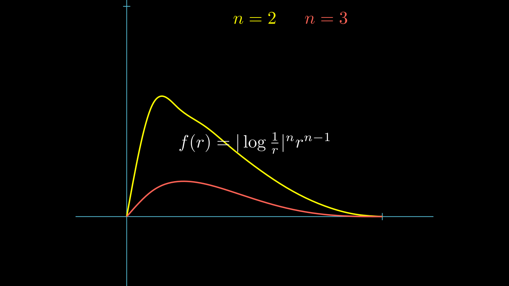

# Sobolev 不等式

我们在这一部分的目标是发现各种Sobolev空间到其他空间的嵌入。         
这里的关键分析工具将是某些所谓的 **Sobolev 型不等式**，我们将在下面对光滑函数进行证明。     
这将建立任意函数在各种相关 Sobolev 空间中的估计。   
因为正如我们在 [逼近](Approximation.md) 中所看到的，光滑函数 是稠密的。

为了清楚的表达，我们首先只考虑 Sobolev 空间 \(W^{1, P} ( U )\)，
并提出如下基本问题：    
如果一个函数 \(u\) 属于 \(W^{1, P} ( U )\)，那么 \(u\) 是否自动属于某个其他空间?（我们称之为 **嵌入** embedded ）   
答案为'是'，但他自动嵌入的是哪个空间则取决于

$$ \begin{align}
    & 1 \le p < n,    \\
    & p = n,    \\
    & n < p \le \infty.
\end{align} $$

## Gagliardo-Nirenberg-Sobolev 不等式

对于第一种情况，我们先对 \(u\in C_c^\infty(R^n)\) 进行研究。    
若 \(1\le p \le n\)， 我们能否找到特定的 \( (C, q) \) ，使得对于任意的 \(u\in C_c^\infty(R^n)\) 可以建立这样的一个估计 ？

$$ \|u\|_{L^q(R^n)} \le C \|Du\|_{L^{p}(R^n)} $$

**定义**：  如果 \(1\le p < n\)，那么 \(p\) 的 Sobolev 共轭为

$$ p^* = \frac{np}{n-p} $$

!!! tip

    1 . 

    $$ \frac{1}{p^*} = \frac{1}{p} - \frac{1}{p}, \quad p^* > p $$

    若不等式成立，那么对 \(u\) 进行伸缩变换，再对不等号两边进行齐次性分析，能得出只有当 \(q = p^*\) ，不等式才有意义。
    查看教材。

    ---

    2 .         
    我们确实需要 \(u\) 具有紧支集，否则 \(u\) 随意上下移动但 \(Du\) 不变，对于范数的估计就不存在了。

!!! Theorem

    **Gagliardcr-Nirenberg-Sobolev inequality**

    设 \(1\le p < n\)，则存在只跟 \(p, n\) 有关的常数 \(C\)，使得对于任意的 \(u\in C_c^1(R^n)\)，有

    $$ \|u\|_{L^{p^*}(R^n)} \le C \|Du\|_{L^{p}(R^n)} $$

**证明**:

**1**.      
首先考虑 \(p=1\) 的情况，因为 \(u\) 具有紧支集， 对于每个 \(i=1, \cdots, n\) 和 \(x\in R^n\)，我们有

$$ u(x) = \int_{-\infty}^{x^i} D_i u(x_1, \cdots, x_{i-1}, \xi_i, x_{i+1}, \cdots, x_n) d\xi_i $$

那么就有

$$ |u| \le \int_{-\infty}^{+\infty} |D_i u(x_1, \cdots, x_{i-1}, \xi_i, x_{i+1}, \cdots, x_n)| d\xi_i $$

我们意识到上式右侧的结果与 \(x_i\) 的取值无关。
下面考虑

$$ |u|^{\frac{n}{n-1}} \le \prod_{i=1}^n \left(\int_{-\infty}^{+\infty} |D_i u(x_1, \cdots, x_{i-1}, \xi_i, x_{i+1}, \cdots, x_n)| d\xi_i \right)^{\frac{1}{n-1}} $$

我们想要估计 \(\int_{R^n}|u|^{\frac{n}{n-1}}\)，那么这里我们就介绍一个重要的不等式

!!! Lemma

    对于 \(f_i \in L^{n-1}(R^{n-1}), i=1, \cdots, n\)，设

    $$ \widetilde{x_i} = (x_1, \cdots, x_{i-1}, x_{i+1}, \cdots, x_n) \in R^{n-1} $$

    令

    $$ f(x) := \prod_{i=1}^n f_i( \widetilde{x_i}) $$

    那么有

    $$ \|f\|_{L^1(R^n)} \le \prod_{i=1}^n \|f_i\|_{L^{n-1}(R^{n-1})} $$

    **证明**:

    $$ \int_{R^n} |f(x)| dx = \int_{R^n} \prod_{i=1}^n |f_i(\widetilde{x_i})| dx = \int_{-\infty}^{+\infty} \cdots \int_{-\infty}^{+\infty} |f_1(\widetilde{x_1})| \cdots |f_n(\widetilde{x_n})| dx_1 \cdots dx_n $$ 

    注意到 \(f_1(\widetilde{x_1})\) 与 \(x_1\) 无关，所以

    $$ \int_{R^n} |f(x)| dx = \int_{R^{n-1}} dx_2 \cdots dx_n |f_1(\widetilde{x_1})| \int |f_2(\widetilde{x_2})| \cdots |f_n(\widetilde{x_n})| dx_1$$

    这时候使用广义 Hölder 不等式

    $$ \int |f_2(\widetilde{x_2})| \cdots |f_n(\widetilde{x_n})| dx_1 \le \left(\int |f_2(\widetilde{x_2})|^{n-1} dx_1 \right)^{\frac{1}{n-1}}  \cdots 
    \left(\int |f_n(\widetilde{x_n})|^{n-1}dx_1 \right)^{\frac{1}{n-1}} $$

    我们有

    $$ \int_{R^n} |f(x)| dx 
    \le  \int_{R^{n-1}} dx_2 \cdots dx_n |f_1(\widetilde{x_1})| 
    \prod_{i=2}^n \left(\int |f_2(\widetilde{x_2})|^{n-1} dx_1 \right)^{\frac{1}{n-1}} $$

    又注意到 \(\left(\int |f_2(\widetilde{x_2})|^{n-1} dx_1 \right)^{\frac{1}{n-1}}\) 与 \(x_2\) 无关，将其提出

    $$ RHS = \int_{R^{n-2}} dx_3 \cdots dx_n \left(\int |f_2(\widetilde{x_2})|^{n-1} dx_1 \right)^{\frac{1}{n-1}}
    \left( \int |f_1(\widetilde{x_1})| \prod_{i=2}^n \left(\int |f_2(\widetilde{x_2})|^{n-1} dx_1 \right)^{\frac{1}{n-1}} dx_2 \right) $$

    最后一向正好有 \(n-1\) 项，所以可以推出

    $$ \int_{R^n} |f(x)| dx 
    \le  \int_{R^{n-1}} dx_3 \cdots dx_n
    \left( \left(\int |f_1(\widetilde{x_1})|^{n-1} dx_2\right)^{\frac{1}{n-1}}
    \prod_{i=2}^n \left(\int |f_2(\widetilde{x_2})|^{n-1} dx_1 dx_2 \right)^{\frac{1}{n-1}} \right) $$

    以此类推，我们得到了

    $$ \int_{R^n} |f(x)| dx \le \prod_{i=1}^n \left(\int |f_i(\widetilde{x_i})|^{n-1} dx_1 \cdots dx_{i-1} dx_{i+1} \cdots dx_n \right)^{\frac{1}{n-1}} $$

    即

    $$ \|f\|_{L^1(R^n)} \le \prod_{i=1}^n \|f_i\|_{L^{n-1}(R^{n-1})} $$

应用引理， 我们有

$$ \begin{align}
\int_{R^n}|u|^{\frac{n}{n-1}} 
&\le \int_{R^n} \prod_{i=1}^n \left(\int_{-\infty}^{+\infty} |D_i u(x_1, \cdots, x_{i-1}, \xi_i, x_{i+1}, \cdots, x_n)| d\xi_i \right)^{\frac{1}{n-1}}   \\
&\le \prod_{i=1}^n \left( \int_{R^n}|D_i u| \right)^{\frac{1}{n-1}} \\
&\le \left(\int_{R^n} |D u|\right)^{\frac{n}{n-1}}
\end{align}  $$

或者更精细一点 [Sobolev空间与偏微分方程引论-王术 2.2.5](../index.md#sobolev空间与偏微分方程引论-王术)

$$ \begin{align}
\int_{R^n}|u|^{\frac{n}{n-1}} 
&\le \prod_{i=1}^n \left(\int_{R^n} |D_i u| \right)^{\frac{1}{n-1}}
= \left( \prod_{i=1}^n \left(\int_{R^n} |D_i u| \right)^{\frac{1}{n}} \right)^{\frac{n}{n-1}} \\
&\le \left( \frac{1}{n}\sum_{i=1}^n \int_{R^n} |D_i u| \right)^{\frac{n}{n-1}} \\
&\le \left( \frac{1}{\sqrt{n}} \int_{R^n} |D u| \right)^{\frac{n}{n-1}}
\end{align}  $$
   
后两个不等式是 几何平均 \(\le\) 算术平均 \(\le\) 平方平均。

至此我们得到了

$$ \|u\|_{L^{\frac{n}{n-1}}(R^n)} \le C \|Du\|_{L^{1}(R^n)} $$

!!! footnote
    其他证明可以看 [Liu-2023](./Liu%20-%202023%20-%20Gagliardo-Nirenberg-Sobolev%20Inequality%20An%20Inducti.pdf)

**2**.  
对于 \(1< p < n\)，将 \(|u|\) 替换成 \(|u|^\gamma\) 来进行分析，\(\gamma\) 待定，但是希望 \(\gamma>1\)，这样可以将 \(u\) 和 \(Du\) 用 Hölder 不等式分离。

$$ \begin{align}
    \left( \int_{R^n} |u|^{\frac{\gamma n}{n-1}} \right)^{\frac{n-1}{n}}
    & \le \int_{R^n} \Big| D|u|^\gamma \Big|  =  \gamma \int_{R^n} |u|^{\gamma-1} |Du| \\
    & \le \gamma \left( \int_{R^n} |u|^{(\gamma-1)\frac{p}{p-1}} \right)^{\frac{p-1}{p}} \left( \int_{R^n} |Du|^p \right)^{\frac{1}{p}}
\end{align} $$

这里为了让右面关于 \(u\) 的积分抵消掉，我们令 \(\frac{\gamma n}{n-1}=(\gamma-1)\frac{p}{p-1}\)，即

$$ \gamma = \frac{p(n-1)}{n-p} > 1 $$

这时，\(\frac{\gamma n}{n-1}=(\gamma-1)\frac{p}{p-1}=\frac{np}{n-p} = p^*\)，\(\frac{n-1}{n} - \frac{p-1}{p} = \frac{1}{p} - \frac{1}{n} = \frac{1}{p^*}\) 故

$$ \left(\int_{R^n} |u|^{p^*}\right)^{\frac{1}{p^*}} \le \gamma \left(\int_{R^n} |Du|^p\right)^{\frac{1}{p}} $$

即

$$ \|u\|_{L^{p^*}(R^n)} \le C \|Du\|_{L^p(R^n)} $$

其中 \(C\) 是只和 \(p, n\) 有关的常数，证毕。

!!! problem

    对于 \(1\le p< n\)， 我们已经建立了对 \(u\in C_c^\infty(R^n)\) 的估计， 那么对于以下情况又怎样呢？

    - \(W^{1, p}(U)\) ，\(q=p^*\), \(U\) 是有界开集， \(\partial U\) 是 \(C^1\) 的     
    - \(W_c^{1, p}(U)\)，\(1 \le q \le p^*\)， \(U\) 是有界开集     
    - \(W^{1, p}(R^n)\)，\(q=p^*\)     

    前两个空间的估计 [教材 5.6.1 Theorem 2 3](../index.md#教材) 做出了回答。只不过 \(C\) 要依赖于 \(p, n, U, (q)\)      

    而对于最后的情况，貌似是成立的。
    只需要说明 \(C_c^\infty(R^n)\) 在 \(W^{1, p}(R^n)\) 中稠密（参考 [逼近](./Approximation.md) ），那么就可以用上一节证明的结论。且 \(C\) 只依赖于 \(p, n\)。

## 边界情况 p=n

我们已经知道上一节的不等式，而且当 \(p\to n\) 时，有 \(p^* = \frac{np}{n-p} \to +\infty \)。        
那么当 \(p=n\), \(u \in W^{1,p}(R^n)\) 时，\(u\) 是否自动属于 \(L^\infty\) 呢？

这个命题只有当 \(n=1\) 时才成立。

$$ |u(x)| = \int_{-\infty}^x Du(t) dt \le \int_{-\infty}^{+\infty} |Du(t)| dt $$

但是 当 \(n\ge 2\) 时，猜测 **不成立**。     
教材中考虑的是 \(u = \log\log(1+\frac{1}{|x|}), x\in B(0, 1)\)。       
类似的，我们也可以考虑 \(u = \log \frac{1}{|x|}, x\in B(0, 1)\)。

显然，\(u\) 是无界的，但是 \(\int_{B(0, 1)} |u|^n\) 和 \(\int_{B(0, 1)} |Du|^n\) 都是有限的。       
这是因为 

$$ \begin{align}
    \int_{B(0, 1)} |u|^n &= \int_0^1 dr \int_{\partial B(0, r)} |u(x)|^n dx \\
    &= n\alpha(n) \int_0^1 |\log \frac{1}{r}|^n r^{n-1} dr \\
\end{align}$$

其中， \(\alpha(n)\) 代表 \(n\) 维单位球的体积，而 \(n\alpha(n)\) 等于 \(n\) 维单位球的表面积。       
而函数 \(|\log \frac{1}{r}|^n r^{n-1}\) 在 \([0, 1]\) 上是有界的，所以积分有限。

\(Du\) 同理。   
所以 \(u\) 属于 \(W^{1,n}(B(0, 1))\)，但不属于 \(L^\infty(B(0, 1))\)。

