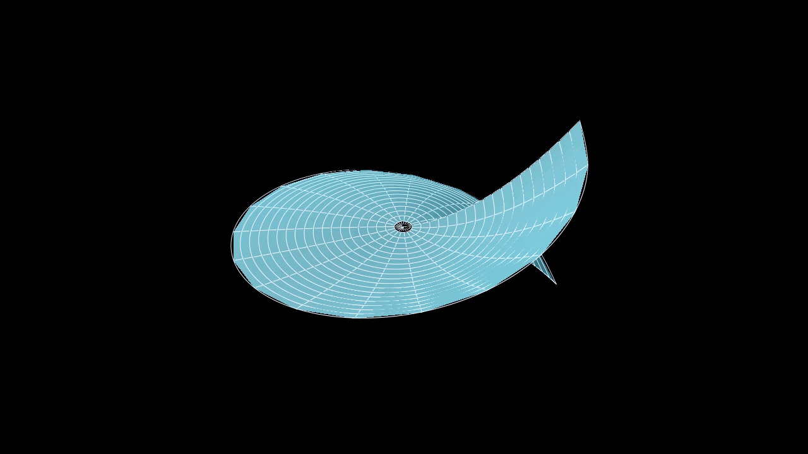

# Sobolev 不等式 $\mathbf{II}$

## Morrey 不等式

!!! Theorem

    

    对于 \(n<p\le\infty\)，有

    $$ \begin{gather*}
        \|u\|_{C^{0, 1-\frac{n}{p}}(\mathbb{R}^n)} \le C(n,p)\|u\|_{W^{1,p}(\mathbb{R}^n)}    \\
        \text{i.e.} \quad 
        W^{1,p}(\mathbb{R}^n) \subset  C^{0, \gamma}(\mathbb{R}^n), \quad \gamma = 1-\frac{n}{p}
    \end{gather*} $$

    

### 有界开集的情形

!!! Theorem

    

    设 \(U\subset \mathbb{R}^n\) 是有界开集，且  \(\partial U\) 是 \(C^1\) 的 
    那么对于 \(n<p\le\infty\)，有

    $$ \begin{gather*}
        \|u\|_{C^{0, 1-\frac{n}{p}}(U)} \le C(n,p, U)\|u\|_{W^{1,p}(U)}    \\
        \text{i.e.} \quad 
        W^{1,p}(U) \subset  C^{0, \gamma}(U), \quad \gamma = 1-\frac{n}{p}
    \end{gather*} $$

    

我们先看一个反例

!!! Example

    我们用极坐标表示 \(x = \rho \cos \theta, y = \rho \sin \theta, \rho \in (0, 1), \theta \in (0, 2\pi)\)，        
    则 \(U = B(0,1)\setminus \{y=0\}\)

    $$ u(x, y) = \rho^2(\theta - \pi) $$

    

    他在 \(U\) 上可微且 \(Du\) 有界，即 \(u\in W^{1,\infty}(U)\)，但是显然不属于 \(C^{0, \gamma}(U)\)，        
    因为在 \(y=0\) 的上下两侧 \(|u(1/2, \epsilon) - u(1/2, -\epsilon)| > C > 0\)，但是 \(|(1/2, \epsilon) - (1/2, -\epsilon)|^\gamma \to 0 \text{  as  } \epsilon \to 0\)

### Rellich-Kondrachov Compactness Theorem 2

[Lawrence C.Evans Partial differential equations 5.7 COMPACTNESS](../index.md#lawrence-cevans-partial-differential-equations)

我们在 [Rellich-Kondrachov Compactness Theorem](./SobolevInequalities.md#rellich-kondrachov-compactness-theorem) 的 Corollary 中提出了一般情况的紧嵌入定理。        
现在我们说明 \(p=\infty\)，或者利用 Morrey 不等式重复说明 \(n < p \le \infty\) 的情况

令 \(U\subset \mathbb{R}^n\) 是有界开集，且 \(\partial U\) 是 \(C^1\) 的，\(n< p \le \infty\)，\(u\in W^{1,p}(U)\)，则 由 Morrey 不等式可以得到

$$ \|u\|_{C^{0, \gamma}(U)} \le C(n,U,p) \|u\|_{W^{1,p}(U)} $$

$$ W^{1,p}(U) \subset C^{0, \gamma}(U), \quad \gamma = 1-\frac{n}{p} $$

但是对于 \(W^{1,p}(U)\) 中的有界序列 \(\{u_m\}_{m=1}^\infty\)，

$$ \|u_m\|_{C^{0}(U)} + \sup_{x,y \in U \; x\neq y} \frac{|u_m(x)-u_m(y)|}{|x-y|^\gamma} \le C(n,U,p) \|u_m\|_{W^{1,p}(U)} \le M $$

所以 \(\{u_m\}\)            
一致有界：\(\|u_m\|_{C^{0}(U)} \le M \);            
等度连续：对 \(\forall \epsilon > 0\) 存在 \(\delta = \left( \frac{\epsilon}{M} \right)^{\frac{1}{\gamma}} \)，使得对 \(\forall x,y \in U \; |x-y| < \delta \)，有 \(|u_m(x)-u_m(y)| < \epsilon \).

则根据 [Arzela-Ascoli 紧性定理] ，\(u_m\) 存在收敛子列 \(\{u_{m_j}\}\) 一致收敛到连续函数 \(u\)，            
即 \(\|u-u_m\|_{C^0(U)} \to 0\)，所以也是逐点收敛的，仿照 [Hölder 空间完备性](./HölderSpaces.md#completeness) 的证明第 3 步，

对于固定的 \(x,y \in U \; x\neq y\)，

$$ \frac{|u(x)- u(y)|}{|x-y|^\gamma} 
= \lim_{j\to \infty} \frac{|u_{m_j}(x)- u_{m_j}(y)|}{|x-y|^\gamma} 
\le \lim_{n\to \infty} [u_{m_j}]_{C^{0,\gamma}(U)} \le M  $$

因此

$$ [u]_{C^{0, \gamma}(U)} = \sup_{x,y\in U \; x\neq y} \frac{|u(x)- u(y)|}{|x-y|^U} \le M $$

我们有 \(u\in C^{0, \gamma}(U)\).     

这说明嵌入不仅是连续的，还是紧的，即

$$ W^{1,p}(U) \subset\subset C^{0, \gamma}(U), \quad \gamma = 1-\frac{n}{p}$$

又因为

$$ \|u\|_{L^q(U)} \le |U|^{\frac{1}{q}}\|u\|_{C^0(U)} \quad \Rightarrow \quad C^{0}(U) \subset L^q(U) $$

因此

$$  W^{1,p}(U) \subset\subset C^{0, \gamma}(U) \subset C^{0}(U) \subset L^q(U) $$

特别的

$$ W^{1,p}(U) \subset\subset L^p(U) \quad n 
 p $$

那么 

$$ \frac{1}{p^{**}} = \frac{1}{p^*} - \frac{1}{n} = \frac{1}{p} - \frac{2}{n}, \quad p^{**} > p^* > p $$

继续下去我们有

$$ \frac{1}{p^{(i)}} = \frac{1}{p} - \frac{i}{n} $$

也就是

$$ W^{k, p}(\mathbb{R}^n) \subset W^{k-1, p^*}(\mathbb{R}^n) \subset \cdots \subset W^{k-i, p^{(i)}}(\mathbb{R}^n), \quad p^{(i)} = \frac{np}{n-ip} $$

直到 \(p^{(i)} \ge n\) 或者 \(i=k\)，我们需要更换不等式。 
那么

### case1

\(k\) 被耗尽前的最后一此，仍有 \(p^{(k-1)} < n\) ，即 \(\frac{1}{p} - \frac{k-1}{n} > \frac{1}{n}\)，
也就是 \(k<\frac{n}{p}\)，那么

$$ W^{k, p}(\mathbb{R}^n) \subset W^{k-1, p^*}(\mathbb{R}^n) \subset \cdots \subset W^{1, p^{(k-1)}}(\mathbb{R}^n) \subset L^{p^{(k)}}(\mathbb{R}^n), \quad p^{(k)} = \frac{np}{n-kp} $$

<video src="../media/videos/Sobolev2/720p30/GSI1.mp4" width="100%"  type="video/mp4" controls="controls" frameborder="0" allowfullscreen="true" webkitallowfullscreen="true" mozallowfullscreen="true" oallowfullscreen="true" msallowfullscreen="true"></video>

### case2

\(k\) 被耗尽前的某一次，有 \(p^{(l-1)} = n, l-1 \le k-1 \) ，即 \(n = lp,  l = \frac{n}{p} \)

<video src="../media/videos/Sobolev2/720p30/GSI2.mp4" width="100%"  type="video/mp4" controls="controls" frameborder="0" allowfullscreen="true" webkitallowfullscreen="true" mozallowfullscreen="true" oallowfullscreen="true" msallowfullscreen="true"></video>

则根据 [p=n](./SobolevInequalities.md#pn) 和 [Morrey 不等式](#morrey)

$$ \begin{align}
    W^{k, \frac{n}{l}}(\mathbb{R}^n) &\subset W^{k-1, \frac{n}{l-1}}(\mathbb{R}^n)  \subset \cdots         \\
    &\subset W^{k-l+1, n}(\mathbb{R}^n) \subset W^{k-l, q}(\mathbb{R}^n) \quad (n\le q <\infty)  \\
    &\subset C^{k-l-1, \gamma}(\mathbb{R}^n) \quad (\forall\gamma \in (0, 1)) \quad \text{ if } k\ge l+1 > \frac{n}{p}      \\
\end{align} $$

!!! Corollary

    特别的，若 \(n = kp\) ，那么

    $$ W^{k, \frac{n}{k}}(\mathbb{R}^n) \subset W^{k-1, \frac{n}{k-1}}(\mathbb{R}^n)  \subset \cdots \subset W^{1, n}(\mathbb{R}^n)  \subset L^q(\mathbb{R}^n) \quad (n\le q <\infty) $$

    又因为 
    
    $$ W^{k, \frac{n}{k}}(\mathbb{R}^n) \subset L^{\frac{n}{k}}(\mathbb{R}^n) \cap L^q(\mathbb{R}^n) \quad (n\le q <\infty) $$
    
    利用插值不等式，有 

    $$ W^{k, \frac{n}{k}}(\mathbb{R}^n) \subset L^q(\mathbb{R}^n) \quad (\frac{n}{k} \le q <\infty) $$

### case3

\(k\) 被耗尽前的某一次，有 \(p^{(l-1)}< n, p^{(l)} > n, l \le k-1 \) ，即 \(l < \frac{n}{p} < l+1, l=\lfloor \frac{n}{p} \rfloor \)

<video src="../media/videos/Sobolev2/720p30/GSI3.mp4" width="100%"  type="video/mp4" controls="controls" frameborder="0" allowfullscreen="true" webkitallowfullscreen="true" mozallowfullscreen="true" oallowfullscreen="true" msallowfullscreen="true"></video>

那么

$$ \begin{align}
    W^{k, p}(\mathbb{R}^n) &\subset W^{k-1, p^*}(\mathbb{R}^n)  \subset \cdots         \\
    &\subset W^{k-l+1, p^{(l-1)}}(\mathbb{R}^n) \subset W^{k-l, p^{(l)}}(\mathbb{R}^n)  \\
    &\subset C^{k-l-1, \gamma}(\mathbb{R}^n) \quad (\gamma = 1- \frac{n}{p^{(l)}})     \\
\end{align} $$

