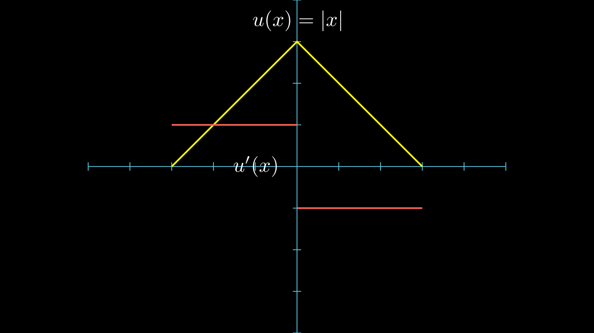
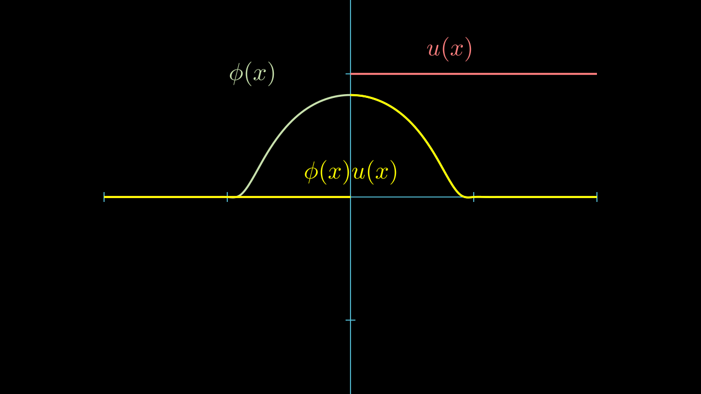

# Sobolev 空间

[Partial Differential Equations Chapter 5](../index.md#教材)

## 动机 Motivation

!!! question

    对于一个几乎处处可导的函数，我们如何定义他的导数？

    

    这个函数这样定义的导数是合理的嘛？

    下面这个 **阶跃函数** 呢？

    

    ---

    我们不妨把导数积分回去，看看是不是原来的函数？      
    哦！第一个函数满足我们的需求，但是第二个函数却不行。        
    可是，为什么？

参考 [Hunter Notes on PDE Example 3.4 3.5](../refs/Hunter%20-%20Notes%20on%20Partial%20Differential%20Equations.pdf)

我们能发现，分段导数无法还原正是由于 *间断点* 的存在。      
<!-- （参考 [信号与系统 阶跃函数](../../SignalAndSystem/index.md)）       -->
想要导数的积分能够还原，我们认为阶跃函数的导数应当是 \(\delta(x)\)，但是它本身并不真的是一个函数。      
我们可以这样形容他，

$$ \delta(x)=0, x\neq 0, \quad \int_{0^-}^{0^+}\delta(x)dx = 1 $$   

在这里他的积分自然而然的出现了，  
显然的，我们发现对于 \(\phi \in C_c^\infty(R)\) 有

$$ \int_{\Omega} \phi(x)\delta(x)dx = f(0) $$

所以我们又可以通过泛函来定义 \( \delta(x) \),

$$ \varphi_\delta: \phi \mapsto \phi(0) $$  

那么现在我们观察 \(\phi(x) u(x)\)

我们希望分部积分公式仍然成立，进行计算得到

$$ \begin{align}
    0 &= \phi(x)u(x)\Big|_{-\infty}^{+\infty} = \int_{-\infty}^{+\infty} \phi'(x)u(x)dx + \int_{-\infty}^{+\infty} \phi(x)u'(x)dx    \\
    &= \int_{0}^{+\infty} \phi'(x)dx + \int_{-\infty}^{+\infty} \phi(x)\delta(x)dx    \\
    &= -\phi(0) + \int_{R} \phi(x)\delta(x)dx
\end{align} $$

这同样要求 \(\delta(x)\) 满足我们上面描述过的的性质。       
而我们再次意识到，如果 \(u(x)\) 是间断的，那么 \(u'(x)\) 就必然 **不能** 用正常的函数来表示，必然引入 \(\delta(x)\)。

---

好了，现在我们说回正题，我们通常希望研究积分和微分具有某种交换性的函数，自然不希望函数在 \(\Omega\) 内随意间断。        
那么我们就去研究这些更有 **正则性** 的函数 \(u\)。    
他要有真正的导函数 \(u'(x)=v(x)\) ，那么应满足分部积分公式，

$$ \begin{gather*}
    0 = \phi(x)u(x)\Big|_{-\infty}^{+\infty} = \int_{-\infty}^{+\infty} \phi'(x)u(x)dx + \int_{-\infty}^{+\infty} \phi(x)u'(x)dx    \\
    \text{i.e.}     \\
    \int_R \phi(x)v(x)dx = -\int_R \phi'(x)u(x)dx    \\
\end{gather*} $$

若是 \(u\) 有任何间断，那么 \(v\) 也必然引入 \(\delta(x)\) ，那么 \(v\) 就不存在了。

## 弱导数 Weak derivatives

设函数 \(u, v\in L_{\text{loc}}^1(\Omega)\) 和多重指标 \(\alpha\)，如果对于任意 \(\phi \in C_c^\infty(\Omega)\) ， 满足

$$ \int_{\Omega} u(x)D^\alpha\phi(x)dx = (-1)^{|\alpha|} \int_{\Omega} v(x)\phi(x)dx $$

则称为 \(v\) 为 \(u\) 的 \(\alpha\) 弱偏导数，记为

$$ D^\alpha u = v $$

!!! warning

    注意和 [准备符号](../PDEIntro/index.md#准备符号) 区分开
    
规定 \(D^0 u = u\).

### 唯一性

若有两个函数 \(v, w \in L_{\text{loc}}^1(\Omega)\) 都是 \(u\) 的弱偏导数，那么对于任意 \(\phi \in C_c^\infty(\Omega)\) 都有      

$$ \int_{\Omega} u D^{\alpha} \phi = (-1)^{|\alpha|} \int_{\Omega} v \phi = (-1)^{|\alpha|} \int_{\Omega} w \phi $$

则

$$ \int_{\Omega} (v-w) \phi = 0 $$

!!! Lemma

    证明见 [Approximation](../../RealAnalysis/Approximation/index.md)

    若 \(u\in L_{\text{loc}}^1(\Omega)\) 对任何 \(\phi \in C_c^\infty(\Omega)\) 满足

    $$ \int_{\Omega} u \phi = 0 $$

    则 \(u = 0 \text{ a.e.}\) 

因此，由引理

$$ v - w = 0 \text{ a.e. in } \Omega $$

这就证明了弱导数的唯一性。

!!! tip

    我们证明了 弱导数唯一性，那么有没有原函数的唯一性呢？

    事实上，对于一个函数 \(u \in W^{1, p}(\Omega), 1 \le p \le \infty\)，其中 \(\Omega\) 是连通的。     
    如果 \(Du= 0 \text{ a.e. in } \Omega\)，那么存在常数 \(c\)，使得 \(u = c \text{ a.e. in } \Omega\)

    我们会在后面证明，参考 [局部逼近定理 Corollary](./Approximation.md#局部逼近定理)

----

本章会研究函数与其弱导数之间的关系。
