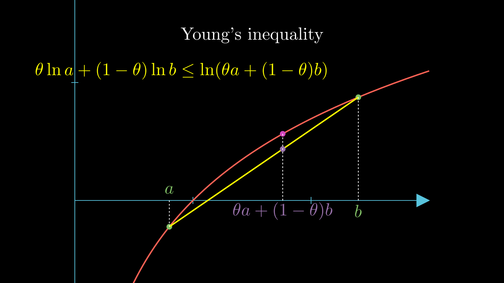

# 不等式 Inequalities

本节介绍一些常用的不等式。

## 共轭指数 conjugate indices

设 \(p, p' \ge 1\)，若

$$ \frac{1}{p} + \frac{1}{p'} = 1 $$

则称 \(p'\) 是 \(p\) 的共轭指数，\(p' = \frac{p}{p-1}\).        
特别的，若 \(p=1\) 规定 \(p' = \infty\)；若 \(p=\infty\) 规定 \(p' = 1\)。

## Young 不等式

对于 \(a,b\ge 0\)

$$ ab \le \frac{a^p}{p} + \frac{b^{p'}}{p'} $$

当 \(p=p'=2\) 时， 就是均值不等式。

当然，我更喜欢另一种理解方式，对于 \(\theta \in [0,1]\)

$$ a^{\theta} b^{1-\theta} \le \theta a + (1-\theta) b $$

这反映了 算术平均 大于 集合平均，并且在技术上可以由均值不等式直接推导出来，但是实际上他是由于 \(\ln x\) 的凸性得到的。

## Hölder 不等式

Hölder 不等式有多个，我们对于函数版本和离散版本都进行介绍。

**1**.

对于 \(a_i, b_i \in \mathbb{R}, i = 1,2,\dots,n\), \(1\le p\le \infty\)

$$ \sum_{i=1}^n a_i b_i \le \left( \sum_{i=1}^n |a_i|^p \right)^{\frac{1}{p}} \left( \sum_{i=1}^n |b_i|^{p'} \right)^{\frac{1}{p'}} $$

我更喜欢下面的形式，对于 \(a_i, b_i \in \mathbb{R}\), \(\theta \in [0,1]\)

$$ \sum_{i=1}^n |a_i|^\theta |b_i|^{1-\theta} \le ( \sum_{i=1}^n |a_i| )^{\theta} ( \sum_{i=1}^n |b_i| )^{1-\theta} $$

我们介绍两种典型的证明方法

当 \(a_i = 0\) 或 \(b_i = 0\) 时，显然成立。    
否则，不妨设 \(\sum_{i=1}^n a_i = 1, \sum_{i=1}^n b_i = 1\)，那么由 [Young 不等式](./index.md#young) 可以得到

$$ \begin{gather*}
    |a_i|^\theta |b_i|^{1-\theta} \le \theta |a_i| + (1-\theta) |b_i|       \\
    \Rightarrow \sum_{i=1}^n |a_i|^\theta |b_i|^{1-\theta} \le \sum_{i=1}^n \theta |a_i| + \sum_{i=1}^n (1-\theta) |b_i| = \theta + (1-\theta) = 1
\end{gather*} $$

不等式得证。

第二种方法在本质上和第一种方法是一样的。

$$ \begin{gather*}
    |a_i|^\theta |b_i|^{1-\theta} \le \theta \lambda^{1-\theta} |a_i| + (1-\theta) \frac{1}{\lambda^\theta}  |b_i|       \\
    \Rightarrow \sum_{i=1}^n |a_i|^\theta |b_i|^{1-\theta} \le \theta \lambda^{1-\theta} \sum_{i=1}^n  |a_i| + (1-\theta) \frac{1}{\lambda^\theta} \sum_{i=1}^n |b_i|
\end{gather*} $$

令 \(\lambda = \dfrac{\sum_{i=1}^n |b_i|}{\sum_{i=1}^n |a_i|}\)，则不等式变为

$$ \sum_{i=1}^n |a_i|^\theta |b_i|^{1-\theta} \le (\theta + 1-\theta) (\sum_{i=1}^n  |a_i|)^\theta (\sum_{i=1}^n |b_i|)^{1-\theta} $$

**2**.

对于 \(a_i, b_i, c_i \in \mathbb{R}, i = 1,2,\dots,n\), 
以及 \(\alpha, \beta, \gamma \in [0,1],  \alpha + \beta + \gamma = 1\)

$$ \sum_{i=1}^n |a_i|^\alpha |b_i|^\beta |c_i|^\gamma \le ( \sum_{i=1}^n |a_i|)^\alpha (\sum_{i=1}^n |b_i|)^\beta (\sum_{i=1}^n |c_i|)^\gamma $$

使用两次 **1** 得证。

更进一步， 对于 \(a_{ij}, j=1,2,\dots,m, i=1,2,\dots,n\) 以及 \(\alpha_j\in [0,1], \sum_{j=1}^m \alpha_j = 1 \) 有

$$ \sum_{i=1}^n \left( \prod_{j=1}^m |a_{ij}|^{\alpha_j} \right) \le \prod_{i=1}^m \left( \sum_{i=1}^n |a_{ij}| \right)^{\alpha_j} $$

**3**.

对于函数 \(f, g\)

$$ \int_\Omega fg \le \left( \int_\Omega |f|^p \right)^{\frac{1}{p}} \left( \int_\Omega |g|^{p'} \right)^{\frac{1}{p'}} $$

即

$$ \|fg\|_1 \le \|f\|_p \|g\|_{p'} $$

或者，对于 \(\theta \in [0,1]\)

$$ \int_\Omega |f|^\theta |g|^{1-\theta} \le  (\int_\Omega |f|)^\theta (\int_\Omega |g|)^{1-\theta} $$

证明和 **1** 类似，不妨设 \(\int|f| = \int |g| = 1 \)

$$ \begin{gather*}
    |f(x)|^\theta |g(x)|^{1-\theta} \le \theta |f(x)| + (1-\theta) |g(x)|       \\
    \Rightarrow \int_\Omega |f|^\theta |g|^{1-\theta} 
    \le \int_\Omega \theta |f| + \int_\Omega (1-\theta) |g| = 1
\end{gather*} $$

!!! Remark

    注意 **1** 和 **3** 之间的关系，实际上只要取 \(f, g\) 是简单函数，

    $$ f = \sum_{i=1}^n a_i \chi_{[i, i+1)}, g = \sum_{i=1}^n b_i \chi_{[i, i+1)} $$

    那么

    $$ \int_R fg = \sum_{i=1}^n a_i b_i \le \left( \sum_{i=1}^n |a_i|^p \right)^{\frac{1}{p}} \left( \sum_{i=1}^n |b_i|^{p'} \right)^{\frac{1}{p'}} = \|f\|_p \|g\|_{p'} $$

    ----

    当 \(\mu(\Omega)\) 有界时，我们取 \(g=\chi_\Omega\)，那么有

    $$ \int_\Omega f = \int_\Omega fg \le \left( \int_\Omega |f|^p \right)^{\frac{1}{p}}\left( \int_\Omega 1^{p'} \right)^{\frac{1}{p'}} = |\Omega|^{\frac{p-1}{p}}\|f\|_p $$

**4**.

与 **2** 类似，对于 \(f_j, j = 1,2,\dots,m\), \(\alpha_j \in [0,1], \sum_{j=1}^m \alpha_j = 1\)

$$ \int_\Omega \prod_{j=1}^m |f_j|^{\alpha_j} \le \prod_{j=1}^m \left( \int_\Omega |f_j| \right)^{\alpha_j} $$

也即

$$ \|f_1\cdots f_m\|_1 \le \|f_1\|_{p_1} \cdots \|f_m\|_{p_m}, \quad 1\le p_j \le \infty , \sum_{j=1}^m \frac{1}{p_j} = 1 $$