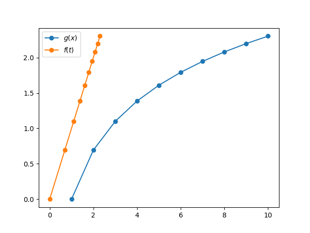

# 分数阶微积分

## Hadamard 积分

在力学和工程学中观察到某些过程的对数性质。

让我们重写 Riemann-Liouville 的积分公式

$$ _{RL}I^q_{x_0, x} g(x) = \frac{1}{\Gamma(q)} \int_{x_0}^x (x-y)^{q-1} g(y) dy $$

令 \(s=e^y\), \(t=e^x\), \(a=e^{x_0}\)，\(f(s)=f(e^y) = g(y)\), 那么

$$ _{RL}I^q_{x_0, x} f(e^x) = \frac{1}{\Gamma(q)} \int_{a}^t (\log \frac{t}{s})^{q-1} f(s) \frac{ds}{s} $$

那么，我们就形式的记

$$ _{H}I^q_{a, t} f(t) = \frac{1}{\Gamma(q)} \int_{a}^t (\log \frac{t}{s})^{q-1} f(s) \frac{ds}{s} $$

## Hadamard 导数

又由于 \(\dfrac{d}{dy}g(y) = s\dfrac{d}{ds}f(s)\)，
因此我们形式地定义算子 \(\delta=t\dfrac{d}{dt}\)，并类似的得到

$$ _{H}D^q f(t) = \frac{1}{\Gamma(n-q)} \delta^n \int_0^t (\log\frac{t}{s})^{n-q-1} f(s) \frac{ds}{s}, \quad n-1<q<n $$

这样，它在实际上就是 Riemann-Liouville 的积分公式，只不过要自变量要经过对数变换。
